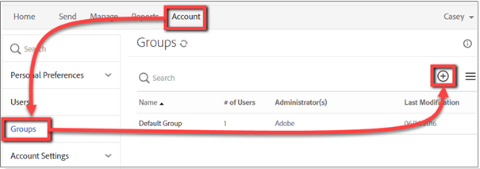
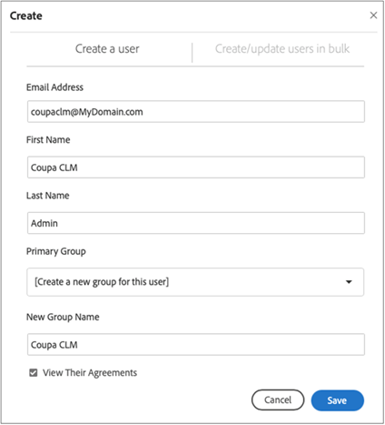
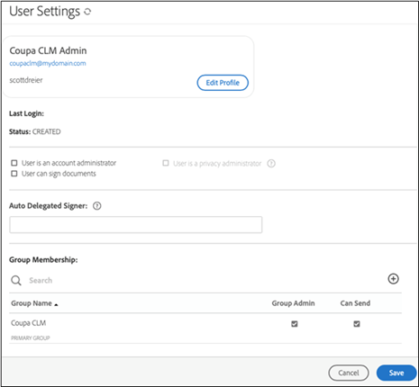

# [!DNL Coupa] Installation Guide{#coupa-installation-guide}

[**Contact Adobe Sign Support**](https://adobe.com/go/adobesign-support-center)

## Overview {#overview}

This document explains how to configure your Adobe Sign account to integrate [!DNL Coupa BSM Suite] instance for getting signatures.

Prerequisites:

* Subscription to Adobe Sign Enterprise, Adobe Sign Developer Edition, or Adobe Sign Enterprise Trial
* Adobe Sign administrator access
* [!DNL Coupa BSM Suite] Standard or Advanced instance

The high-level steps to complete the integration are:

* Configure an Adobe Sign Group for use with [!DNL Coupa BSM Suite]
* Connect [!DNL Coupa BSM Suite] to Adobe Sign 
* Create an Adobe Sign webhook for notifying your [!DNL Coupa BSM Suite] instance

## Configure Adobe Sign Group for [!DNL Coupa BSM Suite] {#configure-adobe-sign-for-coupa}

To have a dedicated usage of Adobe Sign for [!DNL Coupa] within your organization, the administrators must create an Adobe Sign group specifically for [!DNL Coupa BSM Suite] usage. This Adobe Sign group should have a single group admin user account that acts as the service account. Since this service account is used for all signature requests, it should be kept anonymous, for instance `Legal@xyz.com`, `Purchasing@xyz.com`, `CoupaCLM@xyz.com`, or else, rather than personal, such as `Bob.Smith@xyz.com`.  

### Create a User and Group in Adobe Sign {#create-sign user-group}

To create a user in Adobe Sign:

1. Log in to Adobe Sign as the account administrator.
1. Navigate to **[!UICONTROL Account]** > **[!UICONTROL Users]**.
1. Click the  to create a new user. 

    

1. In the dialog that opens, provide the new user details:

    * Provide a functional email that you can access.
        * This user establishes and maintains the OAuth relationship
        * The email address needs to be an actual address for verification.
    * Enter an appropriate First and Last name value.
    * Select **[!UICONTROL Create a new group for this user]** from the User Group.    
    * Provide the **[!UICONTROL New Group Name]** with an intuitive name like *[!DNL Coupa BSM Suite]*.

    

1. Select **[!UICONTROL Save]**.

    Once you save the details, the [!UICONTROL Users] page shows the new user with a [!UICONTROL CREATED] status. 

    

The [!UICONTROL CREATED] status indicates that the user has not yet verified their email address. To verify the email address:

1. Log in to the new user’s email.
2. Find the “Welcome to Adobe Sign” email.

    Note: You may need to check spam/junk folders.

3. Click where it says **[!UICONTROL Click here to set your password]**.
4. Set the password.

Once you verify the email address, the status of the user changes from [!UICONTROL CREATED] to [!UICONTROL ACTIVE].

 

### Define the authenticating user {#define-authenticating-user}

Once you create a Group and a User in that group, you need to make the user a ‘Group Admin’.

To promote the new user in the [!DNL Coupa BSM Suite] group:

1. Navigate to the [!UICONTROL Users] page (if not already there).
2. Double-click on the user.

    It opens an [!UICONTROL Edit] page for the user permissions.

3. Under the Group Membership section, select the **[!UICONTROL Group Admin]** and **[!UICONTROL Can Send]** options.
4. Deselect the **[!UICONTROL User is an account admin]** and **[!UICONTROL User can sign documents]** options.
5. Click **[!UICONTROL Save]**.

 

## Configure the [!DNL Coupa BSM Suite] instance {#configure-coupa}

To complete the connection between the [!DNL Coupa BSM Suite ] instance and Adobe Sign, a trusted relationship must be established between the services. 

To configure the [!DNL Coupa BSM Suite]:

1. Connect your [!DNL Coupa BSM Suite] instance to your Adobe Sign service account that you created above.
1. Create an Adobe Sign webhook instance to notify your Coupa BSM Suite instance about updates to agreements.

For more details on how to connect the [!DNL Coupa BSM Suite] and how to create and register webhook, refer to [Adobe Sign Coupa BSM Suite Instance support documentation](https://success.coupa.com/Support/Docs/Power_Apps/CLM_Standard/Signing_and_Approvals/Enable_E-Signatures_Through_Adobe_Sign_and_DocuSign){target="_blank"}.

## Support {#support}

### [!DNL Coupa BSM Suite] support {#coupa-support}

[!DNL Coupa BSM Suite ] is the integration owner and should be your first point of contact for questions about the scope of the integration, feature requests, or problems in day to day function of the integration.

For any queries, contact [Coupa Support](https://success.coupa.com/Support/Welcome_to_Coupa_Support){target="_blank"}.

### Adobe Sign support {#adobe-sign-support}

Adobe Sign is the integration partner and should be contacted if the integration is failing to obtain signatures, or if notification of pending signatures fails.

For help with using or configuring Adobe Sign, you may contact your Customer Success Manager (CSM) or Adobe Support. Alternatively, Adobe Technical Support can be reached by phone: 1-866-318-4100, wait for product list then enter: 4 and then 2 (as prompted).Adobe Sign administrators can open tickets and obtain support via the Help (?) in the upper right of the Adobe Sign portal.

