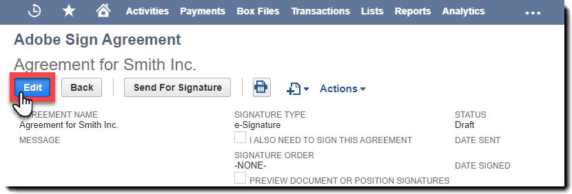

# [!DNL NetSuite] Installation and Customization Guide (v4.0.4) {#install-customize-NetSuite}

## Overview {#overview}

Adobe Sign for [!DNL NetSuite] provides a complete eSignature integration with [!DNL NetSuite]. You can use Adobe Sign for [!DNL NetSuite] integration to send agreements such as contracts, quotes, and other documents, which require electronic signatures, to recipients directly from [!DNL NetSuite]. You can create and send Adobe Sign agreements from customer, lead, quote, and other [!DNL NetSuite] records. Adobe Sign updates [!DNL NetSuite] with the status of agreements and stores the agreements with the associated [!DNL NetSuite] records once they are fully executed. You can view the history of all agreements sent from [!DNL NetSuite] from within the product.

Refer to the [Adobe Sign for [!DNL NetSuite] release notes](https://experienceleague.adobe.com/docs/sign-integrations/using/netsuite/release-notes.html?lang=en) for more information.

## Install the bundle and configure OAuth {#install}

Only a [!DNL NetSuite] administrator can install or update the bundle. To configure OAuth, the [!DNL NetSuite] administrator must have Admin access to Adobe Sign. Before installing the bundle in your Production account, you should install and test the bundle in a [!DNL NetSuite] Sandbox account.

See [Create an Adobe Sign agreement](#createagreement) for more information about testing.

>[!CAUTION]
>
>Customers upgrading to v4.0.4 should NOT remove their existing API key.
>
>See [Set custom preferences](#configure) for more information on how the API key is used.

### Install the bundle for the first time  

1. Navigate to [!UICONTROL **Customization > SuiteBundler > Search & Install Bundles**].  

1. On the *Search & Install Bundles* page, enter **Adobe Sign** as keyword and select **[!UICONTROL Search]**.

1. Select the **Adobe Sign** bundle name.

   

1. On the *[!UICONTROL Bundle Details]* page, select **[!UICONTROL Install]**.
1. In the *[!UICONTROL Preview Bundle Install]* page, select **[!UICONTROL Install Bundle]**. 
   
   (There is no must change any of the default values on the page)

   

1. In the Install dialog that appears, select **[!UICONTROL OK]** to proceed. 

   During the installation process, the status of the bundle displays as *[!UICONTROL Pending]*.

   

1. To display an updated status, select **[!UICONTROL Refresh]**. 

   After the bundle installation completes, *Adobe Sign for [!DNL NetSuite]* displays on the *[!UICONTROL Installed Bundles]* page.

   

1. If you are already an Adobe Sign customer account, follow the steps to  [Configure OAuth after installing or upgrading](#oauth).

   If you do not have an Adobe Sign account, you can [sign up for an enterprise trial](https://esign.adobe.com/adobe-sign-[!DNL NetSuite]-trial-registration.html) account to test the system. Follow the online registration steps to enable your Adobe Sign account.

## Configure OAuth after installing or upgrading {#oauth}

Adobe Sign uses OAuth 2.0 to authenticate your Adobe Sign account within [!DNL NetSuite].

This protocol authorizes your installed [!DNL NetSuite] bundle to communicate with Adobe Sign without requesting your password. Since sensitive information is not being shared directly between the apps, your account is less likely to be compromised.

This authentication does not impact your implementation, but you must do a one-time configuration after installing or upgrading the bundle in your Production or Sandbox account.

The [!DNL NetSuite] administrator who configures OAuth must also have an account level admin access to Adobe Sign.

1. In [!DNL NetSuite], navigate to the *Adobe Sign Config* list page.
   
1. Search for **[!UICONTROL Adobe Sign Config]** (a custom record type) using the Search field in the header.
   
1. In the Search Results page, select **View** for the *Adobe Sign Config* record.

   

1. On the Adobe Sign Config List page, select **[!UICONTROL View]** for the *Using OAuth to Access Adobe Sign APIs* record.

   

1. On the Adobe Sign Config page, select **[!UICONTROL Login In With Adobe Sign]**

   

1. In the Adobe Sign login page that appears, enter your credentials and select **[!UICONTROL Sign In]**.
 
   

1. In the Confirm Access page (for OAuth) that displays, select **[!UICONTROL Allow Access]**

   

1. When the authorization is complete, you are redirected back to Adobe Sign Config page in [!DNL NetSuite], as shown below.

   

   >[!NOTE]
   >
   >When configuring OAuth in your Sandbox account, you may encounter the error “Could not determine customer comp ID” when the authorization completes.
   >
   >
   >To proceed, you must change the account domain portion of the URL (system.[!DNL NetSuite].com) in your browser to point back to the [!DNL NetSuite] Sandbox as follows:
   >
   >
   >Change:
   >
   >
   >system.[!DNL NetSuite].com/app/site/hosting/scriptlet.nl?script=745&deploy=1&web_access_point=https://echosign.com
   >
   >
   >To:
   >
   >
   >system.**sandbox.**[!DNL NetSuite].com/app/site/hosting/scriptlet.nl?script=745&deploy=1&web_access_point=https://echosign.com

## Update the bundle (existing users)  

[!DNL NetSuite] bundle updates are regularly released by Adobe. Existing users of the Adobe Sign for [!DNL NetSuite] integration can update to the latest bundle.

>[!CAUTION]
>
>Customers upgrading to a newer version should NOT remove their existing API key.
>
>See [Setting custom preferences](#configure) for more information on how the API key is used.

### Prerequisites {#prerequisites}

The time required to update to the v4.0.4 bundle depends on the number of agreements that currently have an 'Out for Signature' status. Usually, it takes 7 – 10 minutes to update 100 agreements. Note the number of records to estimate your update time.

To determine the number of agreements that are out for signature:

1. Navigate to **[!UICONTROL Customization > Lists, Records, and Files > Record Types]**, then locate *Adobe Sign Agreement.* 

   Or search for Adobe Sign Agreements in the search bar.

1. For the [!UICONTROL Adobe Sign Agreements] record, select **[!UICONTROL Search]**.

   

1. From the **[!UICONTROL Status]** drop-down, select **[!UICONTROL Out for Signature]** and then select **[!UICONTROL Submit]**.

   

   Note the number of records to estimate your update time.

   

### Update the bundle {#updating-the-bundle}

1. Navigate to **[!UICONTROL Customization > SuiteBundler > Search & Install > List]** and locate your current bundle, as shown below.

   >[!NOTE]
   >
   >If there is a new version of the bundle, an exclamation point icon displays to the right of the *Version* number of your current bundle.

1. From the Action drop-down menu, select **[!UICONTROL Update]**.

   

1. On the Preview Bundle Update page, select **[!UICONTROL Update Bundle]** without changing any of the default values displayed on the page.

   During installation, the status of the bundle displays as *Pending*.

   .

   >[!NOTE]
   >
   >When updating the bundle, you may get a warning message as shown below. If you have not customized your [!DNL NetSuite] eSignature records, you can proceed. If you are unsure, it is suggested that you install the bundle on a Sandbox account to test it first before updating the bundle in a production account.

   

1. To display an updated status, select **[!UICONTROL Refresh]**.

   

   >[!NOTE]
   >
   >If the update is taking a long time because of several agreements with an *Out for Signature* status, you can check the **[!UICONTROL Execution Log]** sub-tab for the *Adobe Sign Bundle Installation* script to determine the progress of your update. See [Determining the progress of the update](#determineprogress) for more information.

   After the bundle update is complete, *Adobe Sign for [!DNL NetSuite]* displays on the *Installed Bundles* page.

   

## Configure the bundle {#configure}

### Set custom preferences  {#set-custom-preferences}

You can use custom preferences to specify how agreements are created and stored in [!DNL NetSuite]. In addition, the *Auto Provision User in Adobe Sign* preference allows you to specify whether [!DNL NetSuite] users are auto-provisioned in Sign services when they send agreements from [!DNL NetSuite].

1. Navigate to **[!UICONTROL Setup > Company > General Preferences]**.
1. Scroll down the page, then select the **[!UICONTROL Custom Preferences]** sub-tab.

   

1. Enable and configure your Adobe Sign preferences as needed:

    * **Enter EchoSign API Key for Your Account**: Don’t add or edit any value in this field.
    * **Use Parent Record Contact as Signer**: If enabled, the parent record contact defaults as the first signer when agreements are created. The sender can easily remove or edit the default signer or add additional signers to the agreement before sending.
    * **Use Trans. Contact as Signer if present**: This preference is valid only if the *Use Parent Record Contact as Signer* preference is also enabled. If enabled, when generating an agreement from a Transaction Record (for example, Quote), the primary Transaction contact defaults as the first signer. See [Transaction Records](#transrecords) for more information. If there is no primary Transaction contact, or if sending from [!DNL NetSuite] object record (for example, Customer record, Partner record), the default recipient is the primary contact for the customer email. The sender can easily remove or edit the default signer or add additional signers to the agreement before sending.
    * **Allow Marking Recipients as Approvers**: If enabled, senders can mark recipients as approvers. Recipients marked as approvers can review and approve agreements, but they are not required to sign them. Approvers may be required to enter data into fields during the approval process.
    * **Preferred Agreement Folder Id**: Used to specify the folder where the final signed agreements are stored. If you don’t set a value for this field, final signed agreements are saved in the same folder as the original document file by default. The Folder Id must be a number.
    * **Auto Attach Transaction PDF**: If enabled, Transaction PDFs are automatically attached to agreements when new agreements are created from Transaction records.
    * **Add Signed PDF as (Attachment or Link)**: If *List* is selected from the drop-down, the Signed PDF is automatically added as a link to the file. If *Attachment* is selected from the drop-down, the signed PDF is stored in [!DNL NetSuite] as an attachment on the Agreement record.
    * **Include Audit Trail PDF with Agreement**: If enabled, audit trail PDFs are automatically attached to Agreement records after the agreements are signed.
    * **Identity Verification Method Applies to**: Enabling any of the identity verification methods dictates to whom the identify verification method is applied. The options are *All Signers, External Signers Only*, or *Internal Signers Only*.

   **Identity Verification Methods** {#identity-verification-methods}

   Enabled identity verification method(s) can be selected when creating an agreement. If more than one identity verification method is enabled here, the Adobe Sign Agreement page displays a **[!UICONTROL Verify Signer Identity]** option.

   * **Enable Password Required to Sign**: Require signers to enter a one-time password you specify.

   * **Enable Knowledge-Based Authentication**: Require signers to provide their name, address and optionally the last four digits of their SSN and then answer a list of questions verifying the information they provided. Available only in the United States.

   * **Enable Web Identity Authentication**: Require signers to verify their identity by signing in to one of the following sites: Facebook, Google, LinkedIn, Microsoft Live, Twitter, or Yahoo!.

   * **Auto Provision User in Adobe Sign**: If enabled, users who send agreements in [!DNL NetSuite] are automatically auto-provisioned with an Adobe Sign user account.

1. Select **[!UICONTROL Save]** to save your preferences.

## Configure automatic status updates {#asu}

The Adobe Sign integration bundle allows you to automatically receive updates in [!DNL NetSuite] regarding the status of the agreements that have been sent from [!DNL NetSuite]. When this feature is enabled, [!DNL NetSuite] always reflects the status of your agreements. You can enable automatic status updates as follows:

1. Navigate to **[!UICONTROL Setup > Company > Enable Features].**
1. Select the **[!UICONTROL SuiteCloud]** sub-tab.
1. Enable the following options:

    * In the SuiteBuilder section, enable **[!UICONTROL Custom Records]** option.
    
    * In the SuiteScript section, enable the **[!UICONTROL Client SuiteScript]** and **[!UICONTROL Server SuiteScript]** options and agree to the terms of service for both.

1. Select **[!UICONTROL Save]**.

   Your options are set as shown in the image.

   

## Objects and record types {#objects}

The Adobe Sign integration bundle already exposes the Adobe Sign Agreement object with many standard [!DNL NetSuite] objects, including: Customer, Estimate, Lead, Opportunity, and Partner records. You can use the Adobe Sign bundle with other record types as well, including custom records.

The Agreement tab can appear with two types of [!DNL NetSuite] records: Entity and Transaction records. We usually assume that a Transaction record is a record (such as quote) that can be converted into a PDF document; whereas an Entity record cannot be converted to a PDF.

## Transaction records {#transrecords}

If the agreement is created from a Transaction record, the first document on the agreement record is the PDF version of the record it came from and the first recipient is the email address of the record. If you don’t want the first document to be a PDF version of the record it came from, go to **[!UICONTROL Setup > Company > General Preferences > Custom Preferences sub-tab]** and disable the **[!UICONTROL Auto Attach Transaction PDF]** option. See [Setting Custom Preferences](#configure) for more information.

Under Custom Preferences, you can also enable the **[!UICONTROL Use Trans. Contact as First Signer]** preference if you want the primary transaction contact to be added automatically as the first signer. When associated with a Transaction record, it displays the **[!UICONTROL Agreements]** and the **[!UICONTROL Send for Signature]** buttons.

 

## Entity records {#entity-records}

If the agreement is created from an Entity record the first recipient is the email address from the record. When associated with an Entity record, only the Agreements tab displays.

## Customize the bundle {#customize}

Customizing the bundle includes the following:

* Deploying the scripts for the Agreements sub-tab and the Send for Signature button for the appropriate record types.
* Setting role permissions for your Adobe Sign record types.
* Modifying permissions to grant access to the *Agreements* sub-tab and the *Send for Signature* button.

 

### Configure Adobe Sign agreements for additional record types  {#configuring-adobe-sign-agreements-for-additional-record-types}

To deploy the *Agreements* sub-tab and the *Send for Signature* button for the appropriate record types:

1. Navigate to **[!UICONTROL Customization > Scripting > Scripts].**

1. On the *Scripts* list page that appears, locate the script you must deploy, then select ****[!UICONTROL View]****.

    * To add the *Send for Signature* button, select **[!UICONTROL Adobe Sign Estimate Button]** script.
    
    * To add the *Agreements* tab, select **[!UICONTROL Adobe Sign Agreement Loader]** script.

1. On the Script page, select **[!UICONTROL Deploy Script]**.

   

1. On the Script Deployment page, do the following:

    * From the *Applies To* list, select the type of record.
    * Optionally, enter script deployment ID. 
    
      Refer to the *Creating a Custom Script Deployment ID* topic in the [!DNL NetSuite] Help Center for more information. If you do not enter an ID, one is generated.
    
    * Check the **[!UICONTROL Deployed]** checkbox.

   

    * Set *Status* to **[!UICONTROL Released]**.

      You do not must specify an *Event Type* or *Log Level*.

    * From the [!UICONTROL *Execute As Role]* drop-down, select **[!UICONTROL Execute as Admin]**.
    
    * With the **[!UICONTROL Audience]** sub-tab active (active by default), select the specific roles or users that you want to grant access to. If you want to grant access to all roles and users, enable the respective **[!UICONTROL Select all]** options.
    
    * Select **[!UICONTROL Save]**. When the change confirmation displays, select **[!UICONTROL Go Back]**.

1. select **[!UICONTROL List]** at the top of the Script Deployment page to get back to the *Scripts* list page.
1. Repeat steps 2 and 3 above for the other script.

## Setting role permissions for Adobe Sign record types {#setting-role-permissions-for-adobe-sign-record-types}

Most [!DNL NetSuite] roles should have permission to use Adobe Sign without additional customization. However, you may must grant permissions for any additional custom roles that have been created.

1. Navigate to **[!UICONTROL Customization > Lists, Records, & Files > Records Types]**.

   

   >[!NOTE]
   >
   >If you do not see the *Record Types* item, navigate to **[!UICONTROL Setup > Company > Enable Features > Suite Cloud tab]** and enable the *Custom Records* option.

1. On the *Record Types* page, select **[!UICONTROL Adobe Sign Agreement]** to select it

   

1. On the *Custom Record Type* page, select **[!UICONTROL Use Permission List]** from the *Access Type* drop-down.

   

   >[!NOTE]
   >
   >The *Adobe Sign Agreement* record type is the only Adobe Sign record type that required the *Uses Permission List* access type. 
   >
   >
   >See step 6 for instructions on setting the access type for the other Adobe Sign record types.

1. Select the **[!UICONTROL Permissions]** sub-tab.

   The list of roles and permissions displays.

   

1. Set permissions as follows for the additional custom roles added to the “[!UICONTROL Adobe Sign Agreement]” record type.

   >[!NOTE]
   >
   >See the *[Setting Up a Permissions List for a Custom Record Type](https://system.[!DNL NetSuite].com/app/help/helpcenter.nl?fid=section_N2879931.html)* topic in the [!DNL NetSuite] Help Center for more information

    1. Select the role from the *Role* list.
    1. Set *Level* to **[!UICONTROL Full]**.
    1. Set *Default Form* to **[!UICONTROL Custom EchoSign Agreement Form]**.
    1. Select **[!UICONTROL Restrict Form]** check box.
    1. Select **[!UICONTROL Add]** to save the changes for the role row.

   

   The new row displays as shown below:

   

   Repeat steps a through e above for all additional custom roles.

    * select **[!UICONTROL Save]** on the *Custom Record Type* page when permissions for all roles have been set.

   The *[!UICONTROL Customer Record Type]* page redisplays.

1. Repeat steps 1 to 3 above to set the *Access Type* for all the other Adobe Sign record types to

   **[!UICONTROL No Permission Required].** This applies to following record types:

    * Adobe Sign Config
    * Adobe Sign Document
    * Adobe Sign Event
    * Adobe Sign Language
    * Adobe Sign Script Errors
    * Adobe Sign Signed Agreement
    * Adobe Sign Signer

### Grant access to the Agreement tab and Send For Signature button  {#granting-access-to-the-agreement-tab-and-send-for-signature-button}

The Adobe Sign integration bundle already exposes the Adobe Sign Agreement object with many standard [!DNL NetSuite] objects (Customer, Estimate [Quote], Lead, and more). The *Agreement* sub-tab is automatically enabled for the following types of objects: Customer, Lead, Opportunity, Partner, Prospect, Quote, and Vendor Bill.

The *[!UICONTROL Send for Signature]* button is automatically enabled **o[!UICONTROL nly for the Quote object]**.

[!DNL NetSuite] administrators can extend the ability to create agreements to additional CRM objects by modifying permissions to add the *Agreement* sub-tab, *Send for Signature* button, or both to those objects.

#### Modifying permissions to grant access to the Send for Signature button  {#modifying-permissions-to-grant-access-to-the-send-for-signature-button}

1. Navigate to **[!UICONTROL Customization > Scripting > Scripts]**.

   The *Scripts* list page displays.

    * If necessary, use the filters to locate the Adobe Sign scripts

1. On the *Scripts* page, locate the *Adobe Sign Estimate Button* script (controls the *Send for Signature* button), then select **View**.

   

1. On the *Script* page, do the following:

    * select the **[!UICONTROL Deployments]** sub-tab  
    
    * Under “*Applies to*” select the link for the entity that you want to modify.

        * **[!UICONTROL Quote]** in this example

   

    * select the **[!UICONTROL Edit]** button on the *Script Deployment* page

   

    * With the **[!UICONTROL Audience]** sub-tab active, select the specific roles or users that you want to grant access to.

        * If you want to grant access to all roles and users, enable the respective **[!UICONTROL Select all]** options

    * select **[!UICONTROL Save]**

   

#### Modifying permissions to grant access to the Agreements tab  {#modifying-permissions-to-grant-access-to-the-agreements-tab}

1. Navigate to **[!UICONTROL Customization > Scripting > Scripts]**
1. On the [!UICONTROL Scripts] page, locate the *[!UICONTROL Adobe Sign Agreement Loader]* script (controls the *Agreements tab*), and then select **[!UICONTROL View]**.
1. On the *Script* page, do the following:

    1. Select the **[!UICONTROL Deployments]** sub-tab
    1. Under “*[!UICONTROL Applies to]*” select the link for the entity that you want to modify access for
    1. On the *[!UICONTROL Script Deployment]* page, select the **[!UICONTROL Edit]** button
    1. With the **[!UICONTROL Audience]** sub-tab active (it is active by default), select the specific roles or users that you want to grant access to. If you want to grant access to all roles and users, enable the respective **[!UICONTROL Select all]** options
    1. select **[!UICONTROL Save]**

## Using the Adobe Sign for [!DNL NetSuite] bundle

In order to send agreements from [!DNL NetSuite] and receive updates on those agreements, users must have the same login ID (email address) in [!DNL NetSuite] and in Adobe Sign.

### Creating an Adobe Sign agreement  

After installing a new bundle in a Sandbox or Production account, you should test the bundle by creating a new agreement. You can create Adobe Sign agreements from an entity record, from a transaction record, or as a standalone agreement.

>[!NOTE]
>
>The process for creating an agreement differs slightly depending on how it is created. The general process involves specifying the options for your agreement, adding one or more agreement documents, and specifying the recipients. The process described below assumes that you are creating the agreement form a customer record.

1. Select or create a customer record you would like to send an agreement from, or you can select another [!DNL NetSuite] record type that has the Agreements tab enabled.  

1. From the record, select the **[!UICONTROL Agreements]** sub-tab.
1. Select **[!UICONTROL New Agreement]**.

   

1. On the *[!UICONTROL Adobe Sign Agreement]* page, select **[!UICONTROL Edit]**.

   

1. Specify the options for your agreement as follows:

    * **Agreement Name** — Enter a name for the agreement.
    * **Message**-Enter a custom message for the recipient.
    * **Signature Type** — Select the type of signature accepted for the document. The options are *e-Signature* and *Fax Signature*.
    
    * **I Also must Sign This Agreement** — Enable this option to indicate that the sender also needs to sign the agreement.
    * **Signature Order**-If the *I Also must Sign This Agreement* option is enabled, select the order in which the sender and recipients should sign. The options are “I sign, then recipients sign”, “Recipients sign, then I sign” and “None”.
    
    * **Preview Document or Position Signatures (or form fields)** — Enable this option to allow senders to preview the agreement and to allow them to add fields (drag and drop signature, initial fields, and other form fields) on to the agreement before it is sent to recipients.
    * **Verify Signer Identity** — Enable this option then select one of the following identity verification options

        * This option display only when more than one of the three signer identity verification methods listed below is enabled in Custom Preferences. (See [Setting custom preferences](#customize) for more information.) If only one preference is enabled, the **[!UICONTROL Verify Signer Identity]** option does not display.

   **Identity Verification Methods** 

   * **Password Required to Sign** — Require Signers to enter a one-time password you specify.
   * **Knowledge Based Authentication** — Require signers to provide their name, address and optionally the last four digits of their SSN and then answer a list of questions verifying the information they provided. Available only in the United States.
   * **Web Identity Authentication** — Require signers to verify their identity by signing in to one of the following sites: Facebook, Google, LinkedIn, Twitter, Yahoo! or Microsoft Live.
   * **Password Required To View PDF** — Enable this option to require that a recipient enter a password before opening a PDF of the agreement or the signed agreement. The PDF file that is sent to everyone is encrypted and requires the password to open it. Don't lose your password as it is not recoverable. In case you lose the password, you must delete that transaction and begin again.
   * **Password/Confirm Password** — If the *Password Required To View PDF* option is enabled, enter the password that should be used to view the agreement.
   * **Remind Recipients to Sign** — Specify if and how often reminders are sent to recipients. The options are *Never*, *Daily* or *Weekly*.
   * **Language:** Specify the language in which the signing page and email notificationsare displayed to the recipients.
   * **Host Signing for the First Signer** — Enable this option to allow the sender host in-person signing for the first signer.
   * **Days Until Signing Deadline** — Enter a whole number to indicate the signing deadline for the agreement (Today’s date + number of days).
   * **Parent Record** — Optionally, select a parent record to link it to the agreement.

   

1. Select the **[!UICONTROL Documents]** tab.

   

1. On the *Documents* sub-tab, attach an existing document from the file cabinet using the *Adobe Sign Document* drop-down, and then select **[!UICONTROL Attach]**.

   Or, click **[!UICONTROL New Adobe Sign Document]** to access the *[!UICONTROL Adobe Sign Document]* page, and then type the name of a document in your [!DNL NetSuite] file cabinet, select files from your Transaction record (if applicable), or attach a new document.

   You can add multiple documents to an agreement.

1. Select **[!UICONTROL Recipients]** sub-tab and specify recipient by either selecting from the contact list or typing an email address.

   

   Each of your recipients can be marked as Signer or CC. If the *Allow Marking Recipients as Approvers Signers* custom preference is enabled, recipients can also be marked as Approvers. See [Setting custom preferences](#customize) for more information.

    * **Signers** must sign the agreement.
    * **Approvers** must approve, but not sign the agreement, and may optionally must add data to an agreement.
    * **CC'd Recipients** are notified of agreement updates and when the agreement is signed and completed. CC recipients are not a party to the signature or approval process.

      If the *Use Parent Record Contact as Signer* custom preference is enabled alone or in conjunction with the *Use Trans. Contact as Signer* preference, the first recipient is defaulted, but can be changed.

1. Select **[!UICONTROL Add]** after entering each recipient.

1. Select **[!UICONTROL Save]** to save the agreement.

### Send agreements for signature 

When the agreement is ready to be sent, select the **[!UICONTROL Send for Signature]** button.

* If the *Preview document or position signatures* option is enabled, click **[!UICONTROL Send for Signature]**. In the window that opens, preview the document or drag form fields to the document before it is sent. Select **[!UICONTROL Send]** to send the agreement to the recipient.

* If the *[!UICONTROL Host Signing for First Signer]* option is enabled, click **[!UICONTROL Send for Signature]**. In the window that opens, allow the signer to sign the document with the sender present.

   A *Host Signing for Current Signer* link also appears next to the *Host Signing for First Signer* field, which can be accessed until the document is signed. Use this link to host agreement signing for multiple signers, or to reopen the pop-up window if it accidentally closed.

Once the agreement is sent, the recipients receive an e-mail informing them of the documents awaiting their signature.

After the recipients have signed the document, the sender receives a notification by e-mail that the document has been signed.

#### Send from a Quote 

Adobe Sign has a direct integration with Quotes in [!DNL NetSuite] so that a PDF of the quote is automatically generated and attached to the agreement record.

When viewing a Quote, select **[!UICONTROL Send for Signature]**. It generates and displays the quote attached to the agreement. You can also add the *Send for Signature* button to other transaction record types. See [Objects and record types](#objects) for more information.

 

### Track status and sending reminders 

After you send an agreement:

* The document status changes to *Out for Signature* in the Agreement details section
* The *Send for Signature* button is replaced by the following three buttons:

  * **Update Status** —  To manually update the status if status updates have not been configured. See [Configuring automatic status updates](#asu) for more information.
  * **Send Reminder** — To send a reminder to the current signer.
  * **Cancel Agreement** — To cancel an agreement. An agreement may be canceled after it has been sent for a signature if all recipients have not yet signed.

A new *Events* sub-tab displays in the agreement record where you can track the agreement’s status.

You can see a history of the agreement events, which includes information about when the agreement was sent, viewed, and signed.

After the agreement is signed:

* Its status changes to *Signed*.
* You can link back to the Parent Record for this agreement using the link.
* You can use the “download” links under Signed Document and Audit Trail to access these documents.
* An additional *Signed Document* sub-tab displays to view thumbnails of the signed document.

>[!NOTE]
>
>After an agreement has been sent for signature, you cannot edit the record. This is to preserve the record of events.

## Uninstall the Bundle 

To uninstall the bundle, follow the steps provided in the [!DNL NetSuite] Help. See the *[Uninstalling a Bundle](https://docs.oracle.com/cloud/latest/[!DNL NetSuite]cs_gs/NSBDL/NSBDL.pdf)* topic in the [!DNL NetSuite] Help Center for more information.

When you uninstall the bundle, the unsigned agreements are deleted. The signed agreements and their corresponding audit PDF files are not affected.

Do NOT uninstall the bundle if you must retain your unsigned agreements.

## Troubleshoot

### Determine the progress of the update  

If the update appears to be taking longer than, you can check the Execution Log sub-tab for the Adobe Sign Bundle Installation script to determine the progress of your update as follows:

1. Navigate to **[!UICONTROL Customization > Scripting > Scripts]**.
1. On the [!UICONTROL Scripts] page, locate the *[!UICONTROL Adobe Sign Bundle Installation]* script, then select **[!UICONTROL Edit]**.
1. On the [!UICONTROL Scripts] page, select the **Execution Log** sub-tab.
1. select **Refresh**.

   The Execution Log updates to reflect the status. The *Details* column displays the progress of the updates to your agreements.

   

### Resolve access token issues 

You may encounter an “Access token provided is invalid or has expired” message when interacting with agreements.

This may occur for the following reasons:

* The [!DNL NetSuite]/Adobe Sign administrator who configured OAuth has revoked the access token
* The access token has expired because no agreements have been sent from [!DNL NetSuite] in the past 60 days
* The [!DNL NetSuite]/Adobe Sign administrator has not successfully completed the initial OAuth configuration

To resolve this issue, execute the OAuth configuration process again. See [Configuring OAuth after installing or upgrading](#oauth) for more information.

 

### Resolve document status issues {#resolvestatus}

If [automatic status updates](#asu) are configured but the agreement status is not updating after sending agreements, try the following:

1. Check the deployment execution log for the *Adobe Sign External Update* script to see if you are receiving calls from Adobe Sign as follows:

    1. Navigate to **[!UICONTROL Customization > Scripting > Script Deployments]**
    1. On the *Script Deployments* page, locate the *Adobe Sign External Update* script, then select **[!UICONTROL Edit]**
        1. On the *[!UICONTROL Script Deployment]* page, select the **[!UICONTROL Execution Log]** sub-tab.

        * You should see an *Updated Agreement Record* entry for each agreement ID

1. Check the deployment execution log for the *Adobe Sign Update Agreements* script to see if there are any errors as follows:

    1. Navigate to **[!UICONTROL Customization > Scripting > Script Deployments]**.
    1. On the [!UICONTROL Script Deployments] page, locate the *[!UICONTROL Adobe Sign Update Agreements]* script with the “[!UICONTROL Scheduled]” status, then select **[!UICONTROL Edit]**.
    1. On the [!UICONTROL Script Deployment] page, select the **[!UICONTROL Execution Log]** sub-tab.
    1. Under [!UICONTROL Type], select **[!UICONTROL Error]** to filter the results.

1. Lastly, check the execution log for the *Adobe Sign Manager* script for errors by following the instructions in step 2 above.

### Resolve MIME type errors  {#resolving-mime-type-errors}

If you get a MIME type error when sending an agreement, this may be because the name in the File Name field does not match the filename and extension of the uploaded file. If you leave the File Name field blank, it automatically populates with the correct filename and extension.

### View script logs {#viewing-script-logs}

You can also view the deployment execution logs for scripts that are not related to document status issues. See [Resolving document status issues](#resolvestatus) for more information.

1. Navigate to **[!UICONTROL Customization > Scripting > Scripts]**. 
   
   The *Scripts* list page displays. If necessary, use the filters to locate the appropriate script.

1. Select **[!UICONTROL View]** for the corresponding script.

1. Select the **[!UICONTROL Execution Log]** sub-tab on the page to display the script log.

## Support {#support}

Go to the [Adobe Sign Support portal](https://adobe.com/go/adobesign-support-center) to access FAQs, documentation, knowledge base articles, or to contact Adobe Support.
