# [!DNL SugarCRM] Installation Guide {#sugarcrm-install-guide}

[Contact Customer Care](https://adobe.com/go/adobesign-support-center)

Adobe [!DNL EchoSign] for [!DNL SugarCRM] is a leading eSignature and web contracting solution that delivers electronic signature automation in [!DNL SugarCRM] for eSignatures and fax signatures. Users can directly send contracts from SugarCRM, view contract history, and save eSigned contracts with associated accounts, contacts, quotes and more.
Adobe [!DNL EchoSign] for [!DNL SugarCRM] is available for all supported versions of SugarCRM, including 6.3 - 6.7 for on-demand or on-premise solutions.

This document is a guide for [!DNL SugarCRM] administrators to learn how to install and configure Adobe [!DNL EchoSign] for [!DNL SugarCRM] plugin.

## Install this Plugin {#install-plugin}

1. Get the Adobe [!DNL EchoSign] for [!DNL SugarCRM]  archive file from the [SugarExchange listing](http://www.sugarexchange.com/product_details.php?product=1123).
1. Log into [!DNL SugarCRM] with your administrator account.
1. Go to **[!UICONTROL Administration]** > **[!UICONTROL Module Loader]**.

    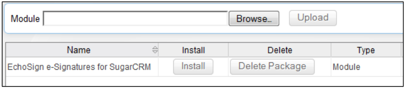 

1. To upload the archive file of the Adobe [!DNL EchoSign] for [!DNL SugarCRM] plugin, select **[!UICONTROL Browse]**, then select the archive file, and then select **[!UICONTROL Upload]**.
1. After the archive file is uploaded, select **[!UICONTROL Install]** to begin installation.
1. Review the terms and conditions, then select **[!UICONTROL Accept]** > **[!UICONTROL Commit]**.
1. If the plugin installs successfully, the progress bar indicates 100% success.  If the progress bar does not reach 100%, select **[!UICONTROL Display Log]** to see the error encountered by SugarCRM.

    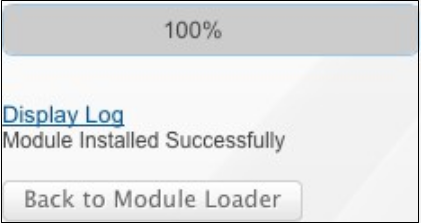

1. After installing, go to **[!UICONTROL Administration > Repair]** and Select **[!UICONTROL Quick Repair and Rebuild]**.

>[!NOTE]
>
>If you are installing the plugin on [!DNL SugarCRM] OnDemand, file a support ticket with [!DNL SugarCRM] to temporarily remove the restrictions of the package inspector for OnDemand so that the package can be installed. This is part of the standard process.

## Upgrade the Plugin {#upgrade-plugin}

If you are updating the Adobe [!DNL EchoSign] for [!DNL SugarCRM] plugin to a newer version, you should install the plugin without uninstalling the previous version.
After upgrading the plugin, go to **[!UICONTROL Administration]** > **[!UICONTROL Repair]** and select **[!UICONTROL  Quick Repair and Rebuild]**.

**Note:** If you uninstall a previous plugin, do not remove the tables during the uninstall. Else, you may lose the [!DNL EchoSign] agreement data.

## Configure the Plugin {#configure-plugin}

1. If you are already an Adobe [!DNL EchoSign] customer, continue to Step 2.  

    If you do not have an [!DNL EchoSign] account, [sign up for a FREE 14-day trial](https://sugarcrmintegration.echosign.com/public/login) and follow the online registration steps to enable your Adobe [!DNL EchoSign] account.
1. Sign in to [Echo Sign account](http://www.echosign.com) and follow these steps:
    1. Select **[!UICONTROL Account]** tab.
    1. Select **[!UICONTROL EchoSign API]** on the lower left side. 
    1. Select **[!UICONTROL Enable API Access]** and get your API key from the page.

    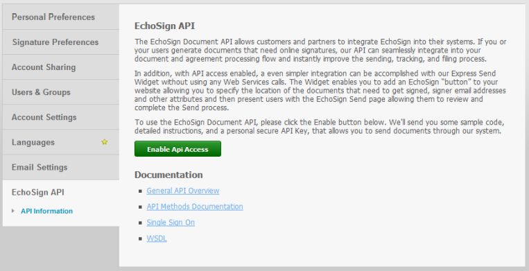

1. In SugarCRM, go to **[!UICONTROL Administration]** > **[!UICONTROL Adobe EchoSign Settings]** and enter the API key in the field labeled **[!UICONTROL EchoSign API Key]**.
1. Optionally, configure the plugin with the following settings:

    1. Automatically attach PDF when creating an agreement from a Quote: Select whether to automatically attach a PDF of the quote if a [!DNL SugarCRM] user creates an EchoSign agreement from the Quotes module.
    1. Manage recipients list: Select which modules appear in the Recipient subpanel in the [!DNL EchoSign] Agreements module. This also adds the [!DNL EchoSign] Agreements sub-panel to those modules.
    1. Add the send buttons to these modules: Select if you want the Create [!DNL EchoSign] Agreement button/action to be included with the Quote module’s primary actions.
    1. Select **[!UICONTROL Save]** to store your settings.

**Note:** The Adobe [!DNL EchoSign] for [!DNL SugarCRM] plugin requires the [PHP SOAP extension](http://www.php.net/manual/en/book.soap.php). To enable SOAP support, configure PHP with enable-soap.

## Get Agreement updates (for [!DNL SugarCRM] versions 6.3 or higher) {#get-agreement-updates}

For version 6.3 and later, you can use the following two options to get agreement updates. In previous versions of SugarCRM, the plug-in by default only offers the Callback Method (Option 1).

### Option 1: Set up the Callback Method for Pushing Updates to EchoSign

If your website is public facing, you can have Adobe EchoSign ping your [!DNL SugarCRM] instance whenever a new event occurs. [!DNL SugarCRM] then updates the agreement status, events and download the signed document (if signed) automatically and in real-time. (If you are behind a firewall, you need to whitelist the [!DNL EchoSign] server IP addresses or use the Scheduled Job method of updating EchoSign Agreements described in the next section of this guide).

1. Go to **[!UICONTROL Administration]** > **[!UICONTROL Adobe EchoSign Settings]**.
1. Check the checkbox **[!UICONTROL Use EchoSign callback method]** to update events and statuses of agreements.
1. Select **[!UICONTROL Save]**.

### Option 2: Set up a Scheduled Job for [!DNL SugarCRM] Instances Behind a Firewall

The [!DNL EchoSign] for [!DNL SugarCRM] plugin can also use a Scheduled Job to query [!DNL EchoSign] for updates to Agreements that are Out For Signature. Scheduled job query method can be used if you have an on-premise [!DNL SugarCRM] installation is behind a firewall.  

To setup:

1. Go to **[!UICONTROL Administration]** > **[!UICONTROL Scheduler]**. 
1. From the tab dropdown menu, select **[!UICONTROL Create Scheduler]**. 
1. Enter a Job Name.
1. For the Job field, select **[!UICONTROL Adobe EchoSign Status Updater]**.
1. Set the job to run as frequently as needed. We suggest setting it to run every 10 minutes, which means that after an agreement is opened, read or signed, it may take up to 10 minutes for [!DNL SugarCRM] to be updated with that information.  

    **Note:** If you have lots of agreements out for signature, having this run too frequently may cause your system to slow down.

    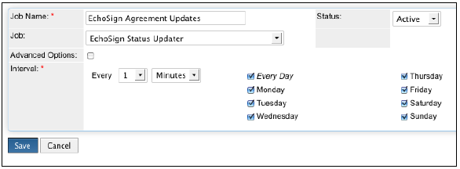
 
1. Go to **[!UICONTROL Administration]** > **[!UICONTROL Adobe EchoSign Settings]**.
1. Uncheck the box **[!UICONTROL Use EchoSign callback method]** to update events and statuses of agreements.
1. Select **[!UICONTROL Save]**.
    Note: Turn on Schedulers in [!DNL SugarCRM] for this to work.

To add EchoSign agreements to other [!DNL SugarCRM] modules:

1. Go to **[!UICONTROL Administration]** > **[!UICONTROL Studio ]**.
1. From the left column folder tree, select the module for adding [!DNL EchoSign] Agreements.
1. Select **[!UICONTROL Relationships ]**> **[!UICONTROL Add Relationships]**.
1. From the dropdown menu, select Type as **[!UICONTROL One to Many]** and Module as **[!UICONTROL EchoSign Agreements]**.
1. Select **[!UICONTROL Save & Deploy]**.

    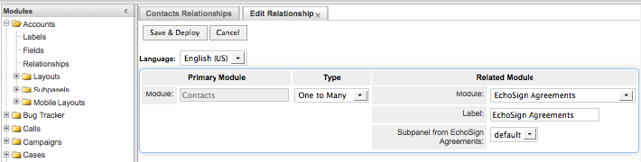
 
    [!DNL EchoSign] Agreements now appear in the module and agreements can be created and tracked there.

    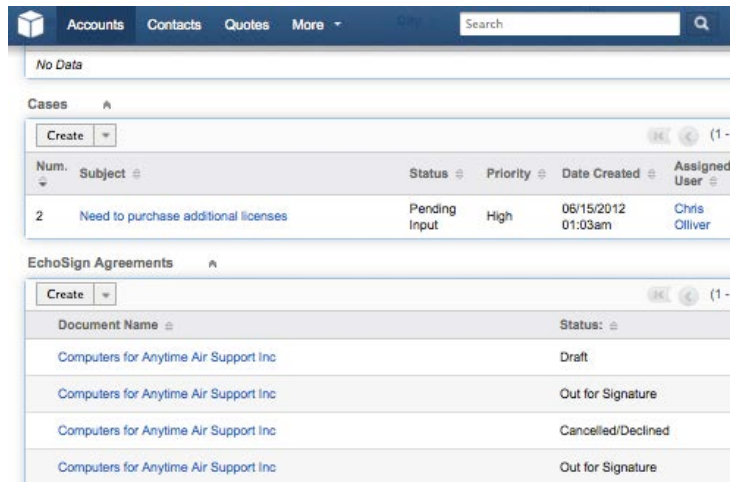

**Other Configuration Steps**

* **Hiding [!DNL EchoSign] Modules**: You can hide the [!DNL EchoSign] Recipients and [!DNL EchoSign] Events modules by going to Administration » Display Module Tabs and Subpanels and moving them to the hidden column. 
* **Disabling packageScan**: If you have enabled packageScan on your own system, you need to disable it during installation. If you are using [!DNL SugarCRM] On-Demand, contact [!DNL SugarCRM] support to disable packageScan for you.

## Uninstall the Plugin {#uninstall-plugin}

1. Log into [!DNL SugarCRM] with your administrator account.
1. Go to **[!UICONTROL Administration]** > **[!UICONTROL Module Loader]**.
1. Select **[!UICONTROL Uninstall]** next to the [!UICONTROL EchoSign for SugarCRM plugin].
1. Select **[!UICONTROL Commit]** to begin uninstallation. You can also select to remove the database tables created for the plugin.

    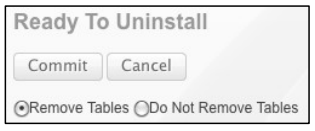

    If the plugin uninstalls successfully, the progress bar indicates 100% success. If the progress bar does not reach 100%, select [!UICONTROL Display Log] to see the error encountered by SugarCRM.

    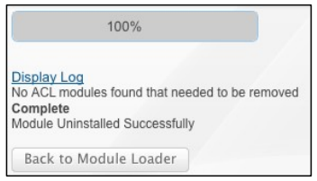
 
## Use Adobe [!DNL EchoSign] for [!DNL SugarCRM] {#use-echosign-for-sugarcrm}

You can create an Adobe [!DNL EchoSign] agreement associated with an account, contact, quote, or other [!DNL SugarCRM] modules. You can attach files, specify recipients, and send for signature. Adobe [!DNL EchoSign] updates [!DNL SugarCRM] with the current status of the agreement and stores the signed contract in [!DNL SugarCRM] once it is fully executed. 

### Create and edit an Adobe [!DNL EchoSign] agreement {#create-edit-agreements}

You can create Agreements through the [!DNL EchoSign] Agreements module or through modules configured by a [!DNL SugarCRM] administrator. 

1. From the [!UICONTROL Actions] list on the [!UICONTROL EchoSign Agreements] tab, select **[!UICONTROL Create EchoSign Agreement]**. 
1. In the main section of the [!DNL EchoSign] Agreement, enter the following information or select from various agreement options:

    1. **[!UICONTROL Name:]** Enter a name for the agreement. 
    1. **[!UICONTROL Signature Type:]** Select the type of signature accepted for the document. The options are e-Signature and Fax Signature. 
    1. **[!UICONTROL I Also Need to Sign This Agreement:]** Indicate whether the sender also needs to sign the agreement. 
    1. **[!UICONTROL Signature Order:]** If the previous option I Also Need to Sign This Agreement is checked, then also select the order in which the sender and recipients should sign.
    1. **[!UICONTROL Remind Recipients to Sign:]** Select how often to remind a recipient to sign a document. The options are Daily or Weekly. 
    1. **[!UICONTROL Days Until Signing Deadline:]** Specify the number of days until the agreement must be signed.
    1. **[!UICONTROL Preview, position signature or add form fields:]**  Select this option to preview the agreement before it is sent or drag and drop signature fields, initial fields, or other form fields on to the agreement before it is sent to recipients. After you have previewed the document or dragged the fields you want on to the document, remember to select the Send button to send the agreement to the recipient.
    1. **[!UICONTROL Host Signing for the First Signer:]** Indicate whether the sender would like to host the agreement signing in-person. 
        * **[!UICONTROL Message:]** Include a message for the recipient. 
        * **[!UICONTROL Account, Opportunity, Quote:]** Select or modify the Account, Opportunity, or Quote associated with this agreement.
        * **[!UICONTROL Language:]** Specify the language in which the signing page and email notifications are displayed to the recipients.

        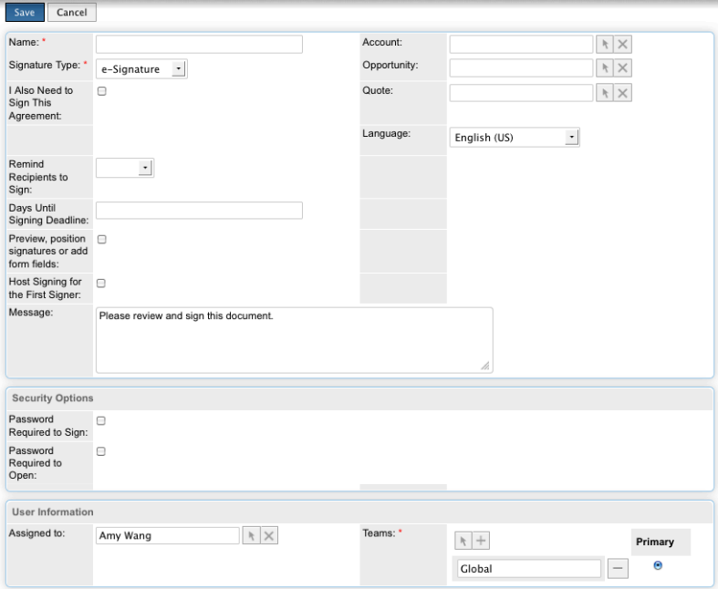

1. In the [!UICONTROL Security Options] section of the [!UICONTROL EchoSign Agreement], enter the following information:

    a) **[!UICONTROL Password Required to Sign:]** Indicate whether a password must be entered before a recipient may sign a document. 
    b) **[!UICONTROL Password Required to Open:]** Indicate whether a password must be entered before a recipient may open a PDF of the agreement or signed agreement
    c) **[!UICONTROL Password:]** Specify the password to use to sign or to open a document. 
    d) **[!UICONTROL Confirm Password:]** Confirm the password to use to sign or to open a document. 

1. In the Other section of the [!DNL EchoSign] Agreement, enter the following information: 

    a) **[!UICONTROL User:]** Specify a [!DNL SugarCRM] user. The default is the user currently signed into the system.
    b) **[!UICONTROL Teams:]** To change the primary team assignment, enter the name of the new primary team. To assign additional teams to the record, click **[!UICONTROL Select]** and select a team from the Team List, or select **[!UICONTROL Add to]** to add team fields and enter the team names. For more information, see ‘Assigning Records to Users and Teams’ in the [!DNL SugarCRM] Application Guide.

1. Select **[!UICONTROL Save]**.  
 
### [!DNL EchoSign] agreement detail view {#agreement-detail-view}

After an [!DNL EchoSign] Agreement is saved, the Detail View of the agreement includes the following subpanels: 

* **[!UICONTROL Recipients:]** Any contacts listed in this subpanel receive the documents specified in the Documents subpanel. You must add one or more recipients before you send the agreement.
* **[!UICONTROL Documents:]** Upload a new document or select a document already uploaded into [!DNL SugarCRM] to send for signature. 
* **[!UICONTROL Events:]** Any action regarding the agreement such as when the agreement was sent for signature, viewed or signed is listed in this subpanel. 
    To edit an [!DNL EchoSign] Agreement, select the [!UICONTROL Edit] button on the [!UICONTROL Detail View] of the agreement. 

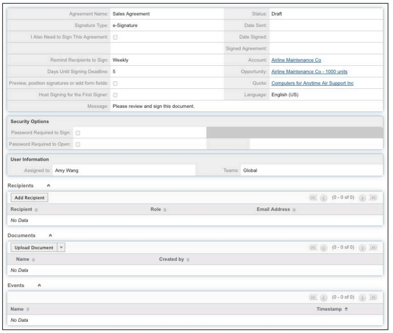

**Note:** After an agreement is sent for signature, the [!UICONTROL Edit] button is removed from the Detail View to preserve the record of events. However, you can enable the Edit button. To do so, go to [!UICONTROL Admin] > [!UICONTROL Adobe EchoSign Settings] and uncheck the option *[!UICONTROL After an agreement is sent out for signature, disable the ability to edit or delete]*.

### Add a document to an [!DNL EchoSign] agreement {#add-document}

[!DNL SugarCRM] users can upload a new document or select a document already uploaded into [!DNL SugarCRM] by using the Documents subpanel of an EchoSign Agreement record. 
To upload a document, select **[!UICONTROL Upload Document]** in the [!UICONTROL Documents] subpanel. 

See the ‘Documents Module’ section of the [!DNL SugarCRM] Application Guide for more information on the individual fields of that form. 

To select a document, click **[!UICONTROL Select]** in the Documents subpanel. See ‘Viewing and Managing Record Information’ in the [!DNL SugarCRM] Application Guide for more information on how to manage related information in subpanels. 

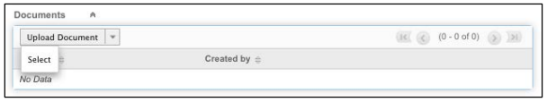
 
### Specify a recipient for an [!DNL EchoSign] agreement {#specify-recipient} 

1. From the [!UICONTROL Recipient] subpanel of an [!DNL EchoSign] Agreement, select **[!UICONTROL Add Recipient]**. 
1. Enter the following information: 
    a) [!UICONTROL Recipient:] Select the type of recipient from the drop-down menu. Type the name or e-mail address of the Recipient in the text field. [!DNL SugarCRM] looks up the name as you type and offer a list of selections. Select a name if a match is found. You can also select the arrow icon to select a name from a pop-up window. To erase the name from the field, select the **[!UICONTROL X]** icon. 
    b) [!UICONTROL Role:] Select a role from the drop-down menu. The options are Signer and CC and Approver. An Approver does not have to sign the document. 
1. Select Save. 

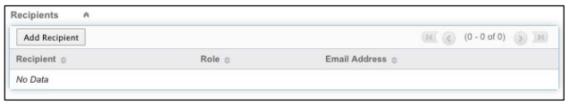

### Send agreements for signature {#send-for-signature}

When agreements are ready to be sent for signature, select **[!UICONTROL Send for Signature]** from the dropdown menu at the top left of the page. Recipients then receive an e-mail informing them of the documents awaiting their signature. After the recipients sign the document, the sender receives an email notification. 
If the [!UICONTROL Host Signing for First Signer] option is checked, you can select **[!UICONTROL Send for Signature]** to allow the signer to sign the document with the sender present. 

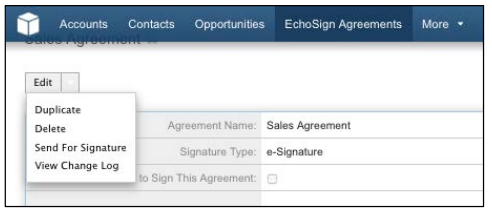

A **[!UICONTROL Host Signing for Current Signer]** link also appears next to the [!UICONTROL Host Signing for First Signer] field, which can be accessed until the document is signed. You can use this link to host agreement signing for multiple signers, or to reopen the pop-up window if it accidentally closed. 
If [!UICONTROL Preview, position signature or add form fields] option is checked, select **[!UICONTROL Send for Signature]** to allow the sender to preview the document or drag fields on to the document before it is sent. You must select **[!UICONTROL Send]** in that window to send the agreement to the recipient. 
 
Figure 5: Select Send for Signature to send a document to a recipient for a signature. 

### Send from a quote record {#send-from-quote-record}

Adobe [!DNL EchoSign] has a direct integration with Quotes in [!DNL SugarCRM] so that the PDF of the quote is automatically generated and attached to the agreement record.
When viewing a Quote, select **[!UICONTROL Create EchoSign Agreement]** to generate the quote and automatically attach it to the agreement. The new agreement also automatically associates any related Opportunity, Account, or Quote.  

To turn off the auto-attachment of the quote PDF to the agreement, go to **[!UICONTROL Administration]** > **[!UICONTROL Adobe EchoSign Settings]**, and uncheck the box *[!UICONTROL Automatically attach PDF when creating an agreement from a Quote]*.

### Cancel an agreement {#cancel-agreement} 

You can cancel an [!DNL EchoSign] Agreement after it has been sent for a signature if all recipients have not yet signed the document. A [!UICONTROL Cancel Agreement] button appears in the Detail View of an agreement after a document is sent for signature. Select **[!UICONTROL Cancel Agreement]** to cancel the agreement. 

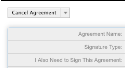
 
Note: If an [!DNL EchoSign] Agreement is sent for signature and the record is deleted, you must cancel the agreement before deleting it. 

### Track signatures {#track-signatures}  

The [!UICONTROL Events] subpanel of an [!DNL EchoSign] Agreement tracks the status of agreements that are sent for signature. To see the latest updates on an [!DNL EchoSign] Agreement, select **[!UICONTROL Update Status]**. The [!UICONTROL Update Status] button is available only after an agreement is sent for signature. 

After an agreement is sent out for a signature, select **[!UICONTROL Update Status]** to retrieve the latest status.

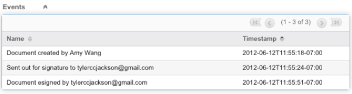
 
### Send reminders {#send-reminders}

To send a reminder to the current signer after sending the agreement, select **[!UICONTROL Send Reminder]**. It immediately sends an email reminder to the current signer about the agreement that is waiting for signature.
 
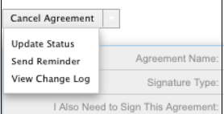
