# [!DNL Veeva Vault] Installation Guide{#veeva-installation-guide}

[**Contact Adobe Sign Support**](https://adobe.com/go/adobesign-support-center)

## Overview {#overview}

This document explains how to establish integration of Adobe Sign with [!DNL Veeva Vault] platform. [!DNL Veeva Vault] is an Enterprise Content Management (ECM) platform built for life sciences. A "Vault" is a content and data repository with typical usage for regulatory filings, research reporting, grants applications, general contracting, and more. A single enterprise can have multiple 'vaults' that must be maintained separately.

The high-level steps to complete the integration are: 

* Activate your Administrative account in Adobe Sign (New Customers Only)
* Create objects to track the history of an agreement lifecycle in Vault.
* Create a new Security profile.
* Configure a Group in Adobe Sign to hold the [!DNL Veeva Vault] integration user.
* Create document fields and renditions.
* Configure web actions and update the document lifecycle.
* Create document type user and user role setup.

>[!NOTE]
>
>Adobe Sign admin must perform the Adobe Sign setup steps within Adobe Sign.

## Configure [!DNL Veeva Vault]

To configure [!DNL Veeva Vault] for integration with Adobe Sign, create certain objects that help track the history of an agreement lifecycle in Vault. Admins must create the following objects:

* Signature
* Signatory
* Signature Event
* Process Locker

### Create Signature object  {#create-signature-object}

Signature object is created to store agreement-related information. A Signature object is a database that contains information under following specific fields:

**Signature object fields**

| Field | Label | Type | Description |
| --- | --- | ---| --- | 
|external_id__c |Agreement Id|String (100) |Holds the Adobe Sign’s unique agreement id|
|file_hash__c |File Hash|String (50) |Holds the md5 checksum of the file that has been sent to Adobe Sign|
|name__v|Name|String (128)|Holds the agreement name|
|sender__c  |Sender  |Object (User)  |Holds the reference to the Vault user that has created the agreement|
|signature_status__c  |Signature Status  |String (75) |Holds the agreement’s status in Adobe Sign|
|signature_type__c|Signature Type|String (20)|Holds the agreement’s signature type in Adobe Sign (WRITTEN or ESIGN)|
|start_date__c|Start Date|DateTime|Date when agreement has been sent for signature|
|cancellation_date__c|Cancellation Date|DateTime|Holds the date when agreement has been cancelled.|
|completion_date__c|Completion Date|DateTime|Holds the date when agreement has been completed.|
|viewable_rendition_used__c|Viewable Rendition Used|Boolean|Flag that indicates if viewable rendition has been sent for signature. (by default, it is true)|

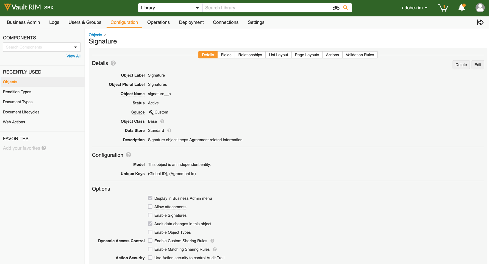 

### Create Signatory object {#create-signatory-object}

Signatory object is created to store information related to the participants in an agreement. It contains information under following specific fields:

**Signatory object fields**

| Field | Label | Type | Description |
| --- | --- | ---| --- | 
|email__c |Email |String (120) |Holds the Adobe Sign’s unique agreement id|
|external_id__c |Participant Id |String (80) |Holds Adobe Sign unique participant’s identifier|
|name__v |Name |String (128) |Holds Adobe Sign participant’s name|
|order__c |Order |Number |Holds Adobe Sign agreement participant’s order number|
|role__c |Role |String (30) |Holds Adobe Sign agreement participant’s role|
|signature__c |Signature |Object (Signature) |Holds the reference to the signature parent record|
|signature_status__c |Signature Status |String (100) |Holds Adobe Sign agreement participant’s status|
|user__c |User |Object (User) |Holds the reference to the signatory’s user record if participant is a Vault user|

 

### Create Signature Event object  {#create-signature-event}

Signature Event object is created to store an agreement's event-related information. It contains information under following specific fields:

| Field | Label | Type | Description |
| --- | --- | ---| --- | 
|acting_user_email__c|Acting User Email|String|Holds the email of Adobe Sign user that performed the action that caused event to be generated|
|acting_user_name__c|Acting User Name|String|Holds the name of Adobe Sign user that performed the action that caused event to be generated|
|description__c|Description|String|Holds the Adobe Sign event’s description|
|event_date__c|Event Date|DateTime|Holds the Adobe Sign event’s date and time|
|event_type__c|Event type|String|Holds the Adobe Sign event’s type|
|name__v|Name|String|Auto-generated event name|
|participant_comment__c|Participant comment|String|Holds the Adobe Sign participant’s comment if any|
|participant_email__c|Participant Email|String|Holds the Adobe Sign participant’s email|
|participant_role__c|Participant Role|String|Holds the Adobe Sign participant’s role|
|signature__c|Signature|Object (Signature)|Holds the reference to the signature parent record|

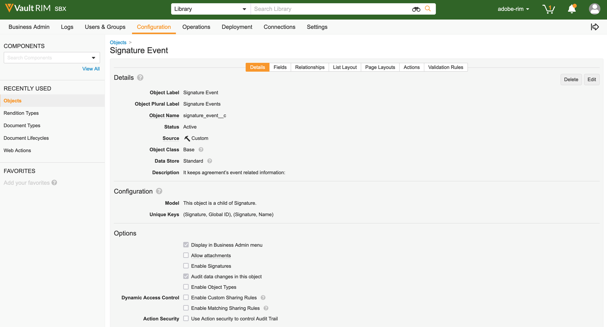 

### Create Process Locker object  {#create-process-locker}

A Process Locker object is created to lock the Adobe Sign integration process. It does not require any custom fields.

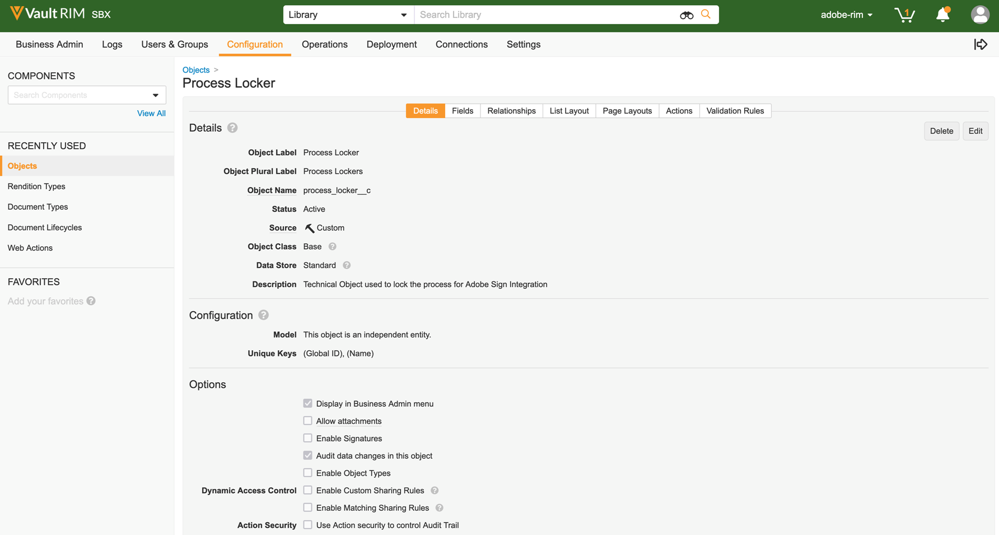 

## Create Security profiles{#security-profiles}

For successful integration of the Vault, a new security profile called *Adobe Sign Integration Profile* is created and its permission is set for *Adobe Sign Admin Actions*. The Adobe Sign Integration Profile is assigned to the system account and is used by the integration when calling Vault APIs. This profile allows permissions for:

* Vault APIs
* Reading, creating, editing, and deleting: Signature, Signatory, Signature Events, and Process Locker objects

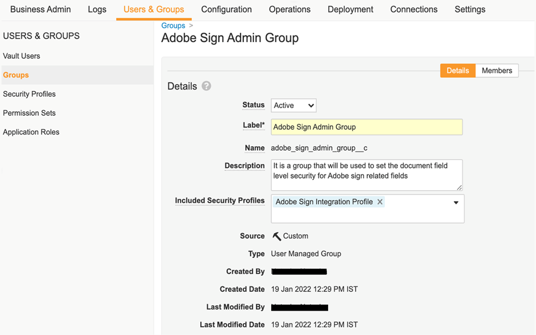 

Security profiles of users who require access to Adobe Sign history in Vault must have Read permissions for Signature, Signatory, and Signature Event objects.

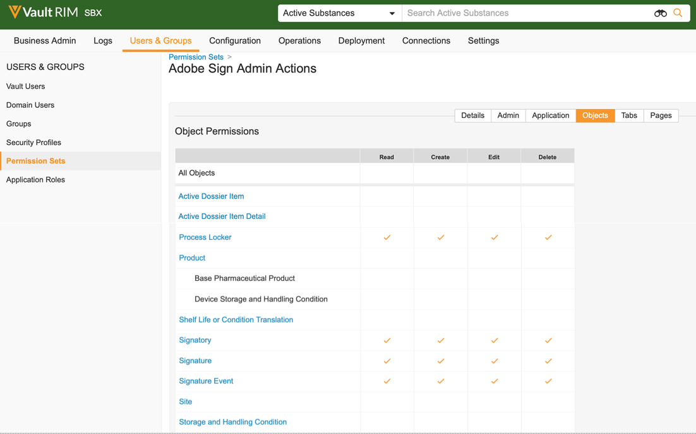 

## Create Group {#create-group}

To configure Adobe Sign for [!DNL Vault], a new group called *Adobe Sign Admin Group* is created. This group is used to set the document field level security for Adobe Sign related fields and should include *Adobe Sign Integration Profile* by default. 

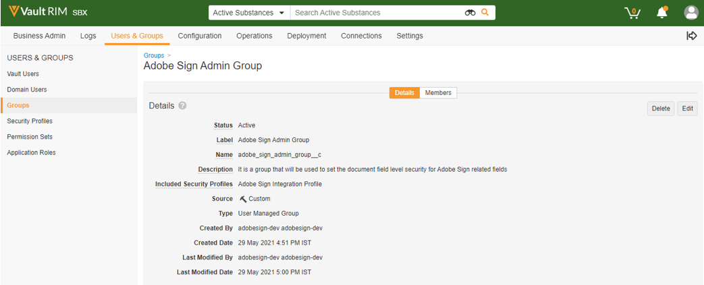

## Create User {#create-user}

The Vault system account user of Adobe Sign integration must:

* Have Adobe Sign Integration Profile
* Have a Security profile
* Have Specific security policy that disables password expiration
* Be a member of Adobe Sign Admin Group.

To ensure that system account user belongs to the Adobe Sign Admin Group for the specific document lifecycle, you must create User Role Setup records.

## Create Application Roles {#create-application-roles}

You must create application role called *Adobe Sign Admin Role*. This role must be defined in lifecycle of each document type that is eligible for Adobe Signature. For each of Adobe Sign specific lifecycle states, Adobe Sign Admin Role is added and configured with the appropriate permissions.

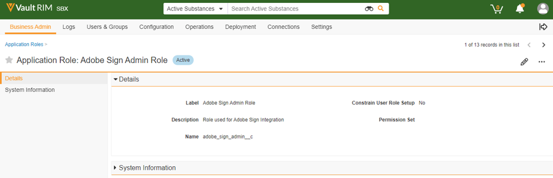

## Create Document Fields {#create-fields}

To establish integration with Adobe Sign, admins must create following two new shared document fields:

* Signature (signature__c) 
* Allow Adobe Sign user actions (allow_adobe_sign_user_actions__c)

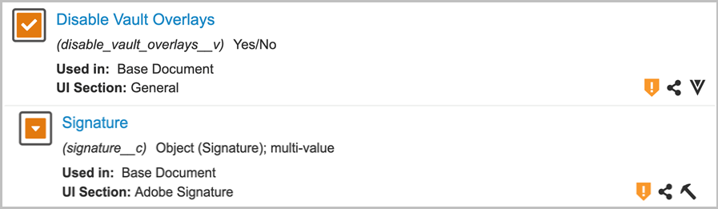

These shared fields must be added to all document types that are eligible for Adobe Signature. Both fields should have a specific security that allows only members of Adobe Sign Admin Group to update their values.

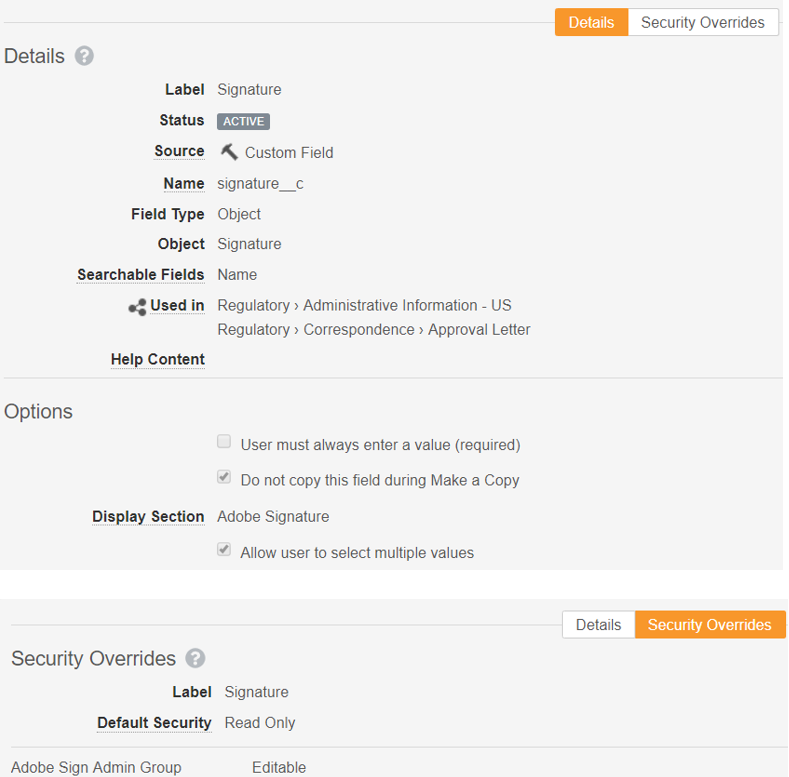

Admins must add the existing shared field *Disable Vault Overlays (disable_vault_overlays__v)* and set it to Active for all document types that are eligible for Adobe Signature. Optionally, the field can have a specific security that allows only members of Adobe Sign Admin group to update its value.

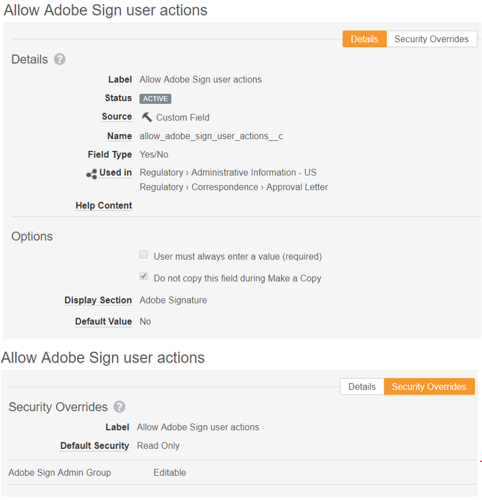

## Create Document Renditions {#create-renditions}

Admins must create a new rendition type called *Adobe Sign Rendition (adobe_sign_rendition__c)*, which is used by Vault integration to upload signed PDF documents to Adobe Sign. The Adobe Sign rendition should be declared for each document type that is eligible for Adobe Signature.

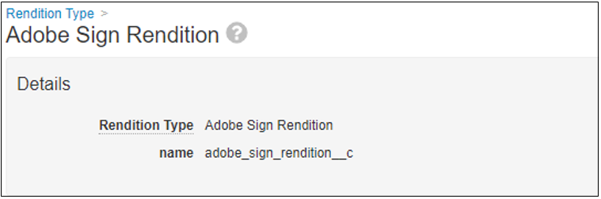

## Configure web actions {#web-actions}

Adobe Sign and Vault integration requires you to create and configure following two web actions:

* **Create Adobe Sign**: It creates or displays Adobe Sign Agreement.

    Type: Document
    Target: Display within Vault
    URL: <https://{integrationDomain}/adobe-sign-int/signature?docId=${Document.id}&majVer=${Document.major_version_number__v}&minVer=${Document.minor_version_number__v}&sessionId=${Session.id}&vaultId=${Vault.Id>}

* **Cancel Adobe Sign**: It cancels an existing agreement in Adobe Sign and reverts a document’s state to the initial one.

    Type: Document
    Target: Display within Vault
    URL: <https://{integrationDomain}/adobe-sign-int/cancel?docId=${Document.id}&majVer=${Document.major_version_number__v}&minVer=${Document.minor_version_number__v}&sessionId=${Session.id}&vaultId=${Vault.Id>}

## Update document lifecycle {#document-lifecycle}

For each document type eligible for Adobe Signature, corresponding document lifecycle must be updated by adding new lifecycle role and states. 

### Lifecycle role {#lifecycle-role}

Adobe Sign Admin application role must be added in all lifecycles used by documents eligible for Adobe Signature. This role should be created with the following options:

* Enable Dynamic Access Control
* Document sharing rules that include only Document Type Group

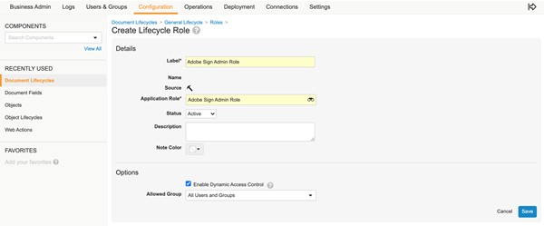

### Lifecycle states {#lifecycle-states}

Adobe Sign agreement lifecycle has following states: 

* DRAFT
* AUTHORING or DOCUMENTS_NOT_YET_PROCESSED
* OUT_FOR_SIGNATURE or OUT_FOR_APPROVAL
* SIGNED or APPROVED
* CANCELLED
* EXPIRED

When a Vault document is sent to Adobe Sign, its state should correspond to the state in which the agreement is. To do so, add following states in every lifecycle used by documents eligible for Adobe Signature:

* **Before Adobe Signature** (Reviewed): This is a placeholder name for the state from which document can be sent to Adobe Sign. Based on the document type, it can be Draft state or Reviewed. Document state label can be customized as per the customer’s requirements. Before Adobe Signature state must define following two user actions:

    * Action that changes the state of document to *In Adobe Sign Draft* state. The name of this user action must be the same for all document types for any lifecycle. If necessary, the criteria for this action can be set to “Allow Adobe Sign user actions equals Yes”. 
    * Action that calls the Web Action ‘Adobe Sign’. This state must have security that allows Adobe Sign Admin Role to: view document, view content, edit fields, edit relationships, download source, manage viewable rendition, and change state.

    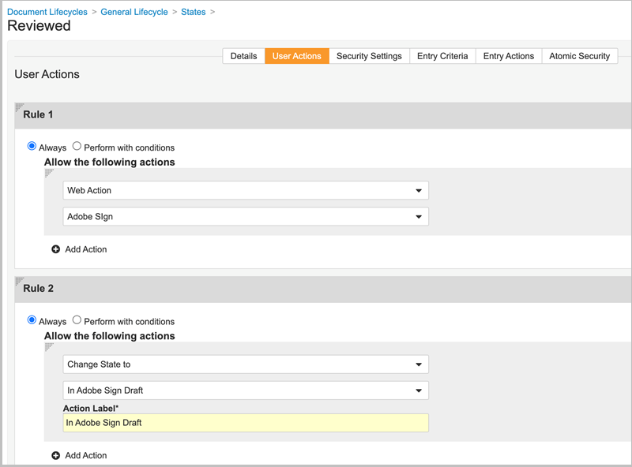

* **In Adobe Sign Draft**: This is a placeholder name for the state that indicates that the document is already uploaded to Adobe Sign and that its agreement is in a DRAFT state. It is a required state. This state must define following five user actions:

    * Action that changes the state of document to *In Adobe Sign Authoring* state. The name of this user action must be the same for all document types for any lifecycle. If necessary, the criteria for this action can be set to “Allow Adobe Sign user actions equals Yes”.
    * Action that changes the state of document to *In Adobe Signing state*. The name of this user action must be the same for all document types for any lifecycle. If necessary, the criteria for this action can be set to “Allow Adobe Sign user actions equals Yes”.
    * Action that changes the state of document to *Adobe Sign Cancelled* state. The name of this user action must be the same for all document types for any lifecycle. If necessary, the criteria for this action can be set to “Allow Adobe Sign user actions equals Yes”.
    * Action that calls the Web Action ‘Adobe Sign’ .
    * Action that calls the Web Action ‘Cancel Adobe Sign’. This state must have security that allowsAdobe Sign Admin role to: view document, view content, edit fields, edit relationships, download source, manage viewable rendition, and change state.

    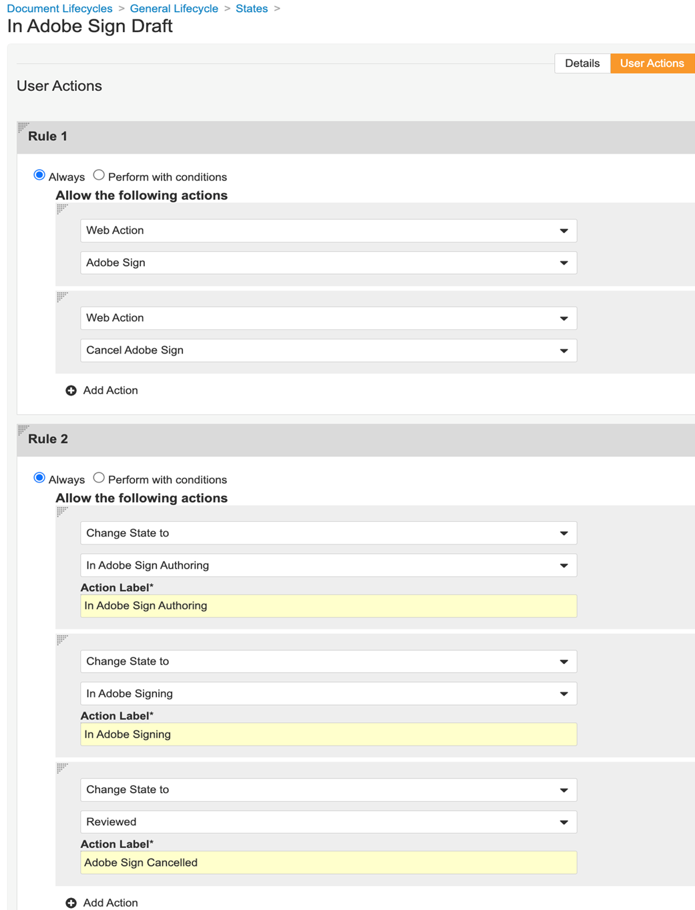

* **In Adobe Sign Authoring**: This is a placeholder name for state that indicates that the document is already uploaded to Adobe Sign and that its agreement is in AUTHORING or DOCUMENTS_NOT_YET_PROCESSED state. It is a required state. This state must have following four user actions defined:

    * Action that changes the state of document to Adobe Sign Cancelled state. The name of this user action must be the same for all document types no matter what lifecycle is. If necessary, the criteria for this action can be set to “Allow Adobe Sign user actions equals Yes”.
    * Action that changes the state of document to In Adobe Signing state. The name of this user action must be the same for all document types no matter what lifecycle is. If necessary, the criteria for this action can be set to “Allow Adobe Sign user actions equals Yes”.
    * Action that calls the Web Action ‘Adobe Sign’ 
    * Action that calls the Web Action ‘Cancel Adobe Sign’. This state must have security that allowsAdobe Sign Admin role to: view document, view content, edit fields, edit relationships, download source, manage viewable rendition, and change state.  

    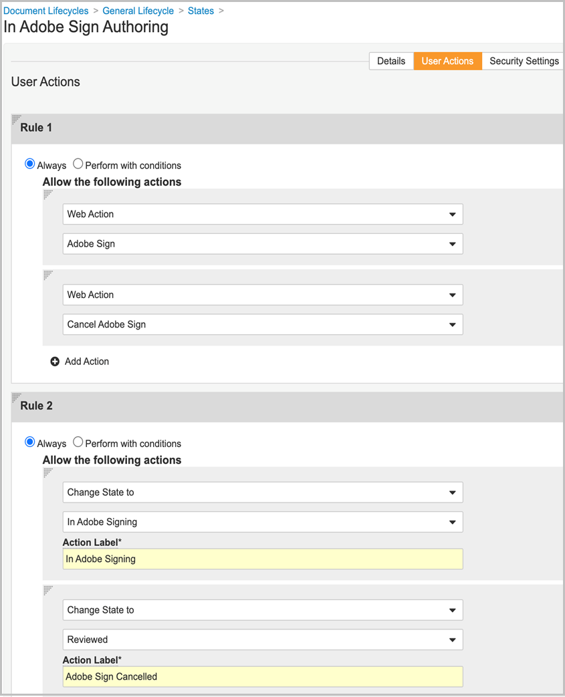

* **In Adobe Signing**: This is a placeholder name for the state that indicates that the document is uploaded to Adobe Sign and that its agreement is already sent to participants (OUT_FOR_SIGNATURE or OUT_FOR_APPROVAL state). It is a required state. This state must have following five user actions defined:

    * Action that changes the state of document to Adobe Sign Cancelled state. The target state of this action can be whatever customer requirement is and it can be different for different types. The name of this user action must be the same for all document types no matter what lifecycle is. If necessary, the criteria for this action can be set to “Allow Adobe Sign user actions equals Yes”.
    * Action that changes the state of document to Adobe Sign Rejected state. The target state of this action can be whatever customer requirement is and it can be different for different types. The name of this user action must be the same for all document types no matter what lifecycle is. If necessary, the criteria for this action can be set to “Allow Adobe Sign user actions equals Yes”.
    * Action that changes the state of document to Adobe Signed state. The target state of this action can be whatever customer requirement is and it can be different for different types. However, the name of this user action must be the same for all document types no matter what lifecycle is. If necessary, the criteria for this action can be set to “Allow Adobe Sign user actions equals Yes”.
    * Action that calls the Web Action *Adobe Sign*.
    * Action that calls Web Action *Cancel Adobe Sign*. This state must have security that allowsAdobe Sign Admin role to: view document, view content, edit fields, edit relationships, download source, manage viewable rendition, and change state.  

    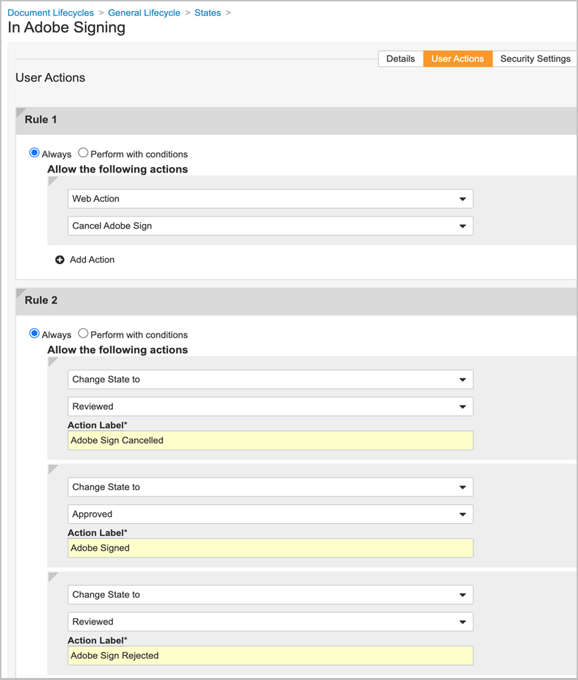

* **Adobe Signed (Approved)**: This is a placeholder name for the state that indicates that the document is uploaded to Adobe Sign and that its agreement is completed (SIGNED or APPROVED state). It is a required state and it can be an existing lifecycle state, like Approved.
This state does not require user actions. This state must have security that allows Adobe Sign Admin role to: view documents, view content and edit fields.

Following diagram illustrates the mappings between Adobe Sign agreement and Vault document states, where the ‘Before Adobe Signature’ state is Draft. 

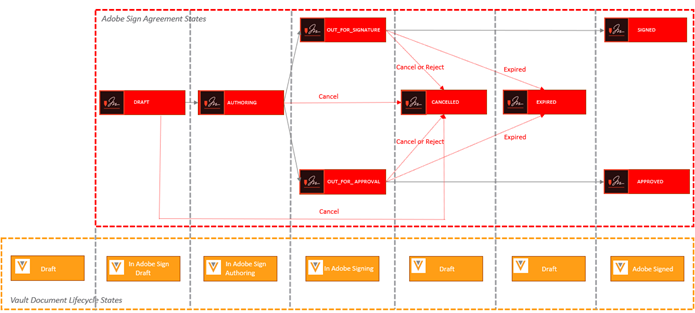

## Create Document Type Group and User Role Setup  {#document-type-group-user-role}

### Create Document Type Group {#create-document-type-group}

Admins must create new Document Type Group record called “Adobe Sign Document”. This document type group is added for all document classifications that are eligible for Adobe Sign process. Since document type group property is not inherited from type to subtype nor from subtype to classification level, it must be set for each document’s classification that is eligible for Adobe Sign.

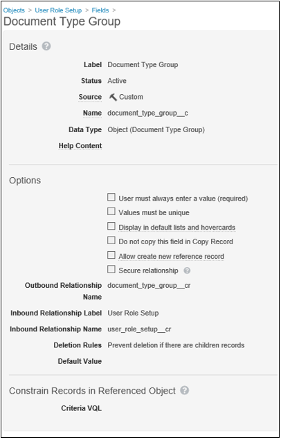

### Create User Role Setup {#create-user-role-setup}

Once lifecycle(s) is(are) properly configured, the system should ensure that Adobe Sign Admin user is added by DAC for all documents that are eligible for Adobe Sign process. This is done by creating the appropriate User Role Setup record that specifies:

* Document Type Group as 'Adobe Sign Document',
* Application Role as 'Adobe Sign Admin Role', and
* Integration user.

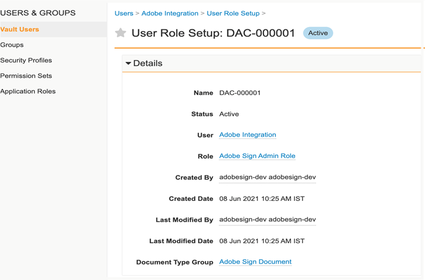

>[!NOTE]
>
>If User Role Setup object does not contain the field that refers to Document Type Group object, then this field should be added.

## Connect [!DNL Veeva Vault] to Adobe Sign using middleware {#connect-middleware}

After completing the setup for [!DNL Veeva Vault] and the Adobe Sign Admin account, the administrator must create a connection between the two accounts using the middleware. The [!DNL Veeva Vault] and Adobe Sign account connection is initiated by Adobe Sign Identity and then it is used to store the Veeva Vault identity. 
For system security and stability, the administrator must use a dedicated [!DNL Veeva Vault] system/service/utility account, such as `adobe.for.veeva@xyz.com`, instead of a personal user account, such as `bob.smith@xyz.com`.

An Adobe Sign account administrator must follow the below steps to connect [!DNL Veeva Vault] to Adobe Sign using middleware:

1. Go to the [Adobe Sign for [!DNL Veeva Vault] Home page](https://static.adobesigncdn.com/veevavaultintsvc/index.html).
1. Select **[!UICONTROL Login]** from the top-right corner. 

    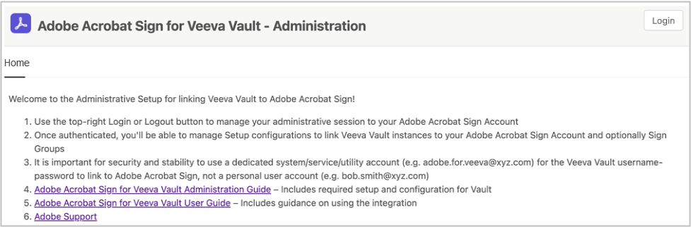

1. In the Adobe Sign login page that opens, provide the account administrator email and password, then select **[!UICONTROL Sing in]**.

    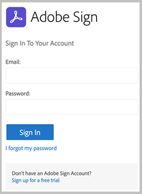

    After successful signing in, the page displays the associated email id and a Settings tab, as shown below.

    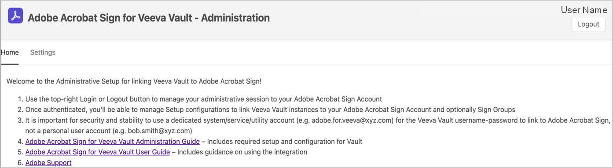

1. Select the **[!UICONTROL Settings]** tab. 

    The Settings page displays the available connections and shows none in case of first connection setup, as shown below.

    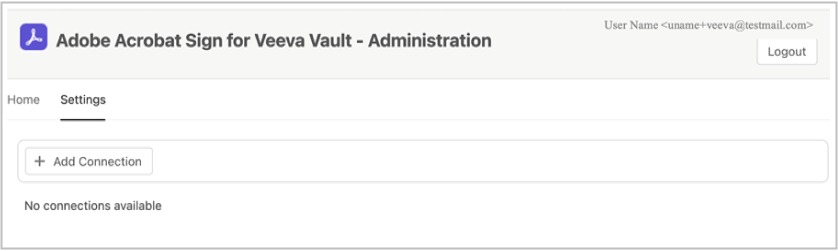

1. Select **[!UICONTROL Add Connection]** to add a new connection.

1. In the Add Connection dialog that opens, provide the required details including the [!DNL Veeva Vault] credentials. 

    The Adobe Sign Credentials are auto populated from the initial Adobe Sign login.

    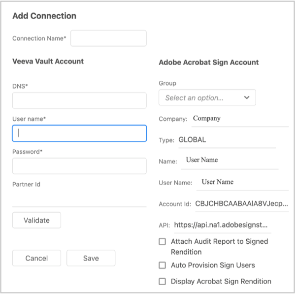

1. Select **[!UICONTROL Validate]** to validate the account details.

    On successful validation, you see a 'User validated successfully' notification, as shown below. 

    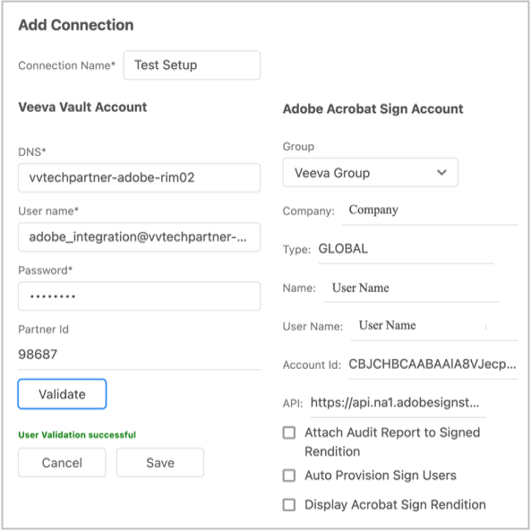

1. To restrict the usage to a particular Adobe Sign Group, expand the **[!UICONTROL Group]** drop-down list and select one of the available groups.

   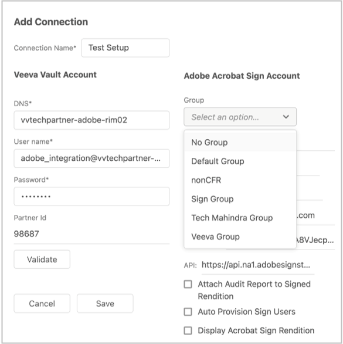

1. Select **[!UICONTROL Save]** to save your new connection.

    The new connection appears under the Settings tab showing successful integration between [!DNL Veeva Vault] and Adobe Sign.

    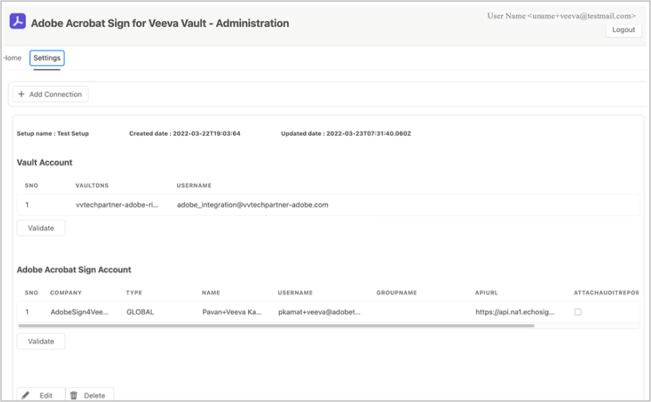

## Package deployment lifecycle {#deployment-lifecycle}

### General deployment lifecycle {#general-deployment}

**Step 1.** Create a new application Role called 'Adobe Sign Admin Role'.

**Step 2.** Create a new document Type Group called 'Adobe Sign Document'.

**Step 3.** Deploy the package. 
  
**Step 4.** Create a new User-Managed Group called 'Adobe Sign Admin Group'.

**Step 5.** Create an Integration User profile with Security profile “Adobe Sign Integration Profile” and assign it to Adobe Sign Admin Group.

**Step 6.** Assign reader permissions for all security profiles to the Signature, Signatory and Signature Event objects for users who require access to Adobe Sign history in Vault.

**Step 7.** Define the Adobe Sign Admin Role in lifecycle of each document type that is eligible for Adobe Signature. For each Adobe Sign specific lifecycle states, this role is added and configured with the appropriate permissions.

**Step 8.** Declare Adobe Sign Rendition for each document type that is eligible for Adobe Signature.

**Step 9.** For each document type eligible for Adobe Signature, update the corresponding document lifecycle by adding new lifecycle role and states.

**Step 10.** Add the document type group called 'Adobe Sign Document' for all document classifications that are eligible for Adobe Sign process.

**Step 11.** Once all configurations are complete, the system should ensure that Adobe Sign Admin user is added by DAC for all documents that are eligible for Adobe Sign process. This is done by creating the appropriate User Role Setup record that specifies the Document Type Group as 'Adobe Sign Document', Application Role as 'Adobe Sign Admin Role' and an integration user.

### Specific deployment lifecycle {#specific-deployment}

**Step 1.** Create a new Application Role called 'Adobe Sign Admin Role'.

**Step 2.** Create a new Document Type Group called 'Adobe Sign Document'.

**Step 3.** Deploy the package. 

**Step 4.** Create a new user-managed Group called 'Adobe Sign Admin Group'.

**Step 5.** Create one Integration User profile with Security profile called 'Adobe Sign Integration Profile' and assign to Adobe Sign Admin Group.
