# [!DNL Veeva Vault] Installation Guide{#veeva-installation-guide}

[**Contact Adobe Sign Support**](https://adobe.com/go/adobesign-support-center)

## Overview {#overview}

This document explains how to establish integration of Adobe Sign with [!DNL Veeva Vault] platform. [!DNL Veeva Vault] is an Enterprise Content Management (ECM) platform built for life sciences. A "Vault" is a content and data repository with typical usage for regulatory filings, research reporting, grants applications, general contracting, and more. A single enterprise can have multiple 'vaults' that must be maintained separately.

The high-level steps to complete the integration are: 

* Activate your Administrative account in Adobe Sign (New Customers Only).
* Create objects to track the history of an agreement lifecycle in Vault.
* Create a new Security profile.
* Configure a Group in Adobe Sign to hold the [!DNL Veeva Vault] integration user.
* Create document fields and renditions.
* Configure web actions and update the document lifecycle.
* Create document type user and user role setup.
* Connect Veeva Vault to Adobe Sign using middleware.

>[!NOTE]
>
>Adobe Sign admin must perform the Adobe Sign setup steps within Adobe Sign.

## Configure [!DNL Veeva Vault] {#configure-veeva}

To configure [!DNL Veeva Vault] for integration with Adobe Sign, you need to implement the below listed steps.

### Step 1. Create Group {#create-group}

To configure Adobe Sign for [!DNL Vault], a new group called *Adobe Sign Admin Group* is created. This group is used to set the document field level security for Adobe Sign related fields and should include *Adobe Sign Integration Profile* by default. 

### Step 2. Deploy the package {#deploy-package}

[Deploy the package](https://helpx.adobe.com/content/dam/help/en/PKG-AdobeSign-Integration.zip) and follow through the steps. Once deployed, the package creates:

* Custom objects: Signature object, Signatory object, Signature Event object, Process Locker object 
* Signature object page layout
* Signature Event object page layout
* Signatory object page layout
* Process Locker object page layout
* Adobe Sign Rendition type
* Shared field signature__c , allow_adobe_sign_user_actions__c 
* Adobe Sign Web Action
* Cancel Adobe Sign Web Action
* Adobe Sign Admin Actions Permission set
* Adobe Sign Integration Profile security profile
* Application role Adobe Sign Admin Role 
* Document type group 'Adobe Sign Document'

#### Signature object {#signature-object}

Signature object is created to store agreement-related information. A Signature object is a database that contains information under following specific fields:

**Signature object fields**

| Field | Label | Type | Description |
| --- | --- | ---| --- | 
|external_id__c |Agreement Id|String (100) |Holds the Adobe Sign’s unique agreement id|
|file_hash__c |File Hash|String (50) |Holds the md5 checksum of the file that has been sent to Adobe Sign|
|name__v|Name|String (128)|Holds the agreement name|
|sender__c  |Sender  |Object (User)  |Holds the reference to the Vault user that has created the agreement|
|signature_status__c  |Signature Status  |String (75) |Holds the agreement’s status in Adobe Sign|
|signature_type__c|Signature Type|String (20)|Holds the agreement’s signature type in Adobe Sign (WRITTEN or ESIGN)|
|start_date__c|Start Date|DateTime|Date when agreement has been sent for signature|
|cancellation_date__c|Cancellation Date|DateTime|Holds the date when agreement has been cancelled.|
|completion_date__c|Completion Date|DateTime|Holds the date when agreement has been completed.|
|viewable_rendition_used__c|Viewable Rendition Used|Boolean|Flag that indicates if viewable rendition has been sent for signature. (by default, it is true)|

 

#### Signatory object {#signatory-object}

Signatory object is created to store information related to the participants in an agreement. It contains information under following specific fields:

**Signatory object fields**

| Field | Label | Type | Description |
| --- | --- | ---| --- | 
|email__c |Email |String (120) |Holds the Adobe Sign’s unique agreement id|
|external_id__c |Participant Id |String (80) |Holds Adobe Sign unique participant’s identifier|
|name__v |Name |String (128) |Holds Adobe Sign participant’s name|
|order__c |Order |Number |Holds Adobe Sign agreement participant’s order number|
|role__c |Role |String (30) |Holds Adobe Sign agreement participant’s role|
|signature__c |Signature |Object (Signature) |Holds the reference to the signature parent record|
|signature_status__c |Signature Status |String (100) |Holds Adobe Sign agreement participant’s status|
|user__c |User |Object (User) |Holds the reference to the signatory’s user record if participant is a Vault user|

 

#### Signature Event object {#signature-event}

Signature Event object is created to store an agreement's event-related information. It contains information under following specific fields:

| Field | Label | Type | Description |
| --- | --- | ---| --- | 
|acting_user_email__c|Acting User Email|String|Holds the email of Adobe Sign user that performed the action that caused event to be generated|
|acting_user_name__c|Acting User Name|String|Holds the name of Adobe Sign user that performed the action that caused event to be generated|
|description__c|Description|String|Holds the Adobe Sign event’s description|
|event_date__c|Event Date|DateTime|Holds the Adobe Sign event’s date and time|
|event_type__c|Event type|String|Holds the Adobe Sign event’s type|
|name__v|Name|String|Auto-generated event name|
|participant_comment__c|Participant comment|String|Holds the Adobe Sign participant’s comment if any|
|participant_email__c|Participant Email|String|Holds the Adobe Sign participant’s email|
|participant_role__c|Participant Role|String|Holds the Adobe Sign participant’s role|
|signature__c|Signature|Object (Signature)|Holds the reference to the signature parent record|

 

#### Process Locker object {#process-locker}

A Process Locker object is created to lock the Adobe Sign integration process. It does not require any custom fields.

 

The Signature, Signatory, Signature Event, and Process Locker objects that come as a part of the deployment package have the 'Audit data changes for this object' property enabled by default.

**Note:** You can have Vault capture object record data changes in audit logs by enabling the Audit data changes setting. This setting is off by default. Once you enable this setting and create records, you can no longer disable it. If this setting is off and records exist, only a Vault Owner can update the setting.

#### **Display Participants and History for the Signature Object** {#display-participants-history}

The Signature object that comes as a part of the deployment package comes with the [Signature Detail Page Layout](https://vvtechpartner-adobe-rim.veevavault.com/ui/#admin/content_setup/object_schema/pagelayout?t=signature__c&d=signature_detail_page_layout__c). The Page Layout has sections for Participants and History.

* The *Participants* section has the Related Objects Section that is configured as shown in the image below.

    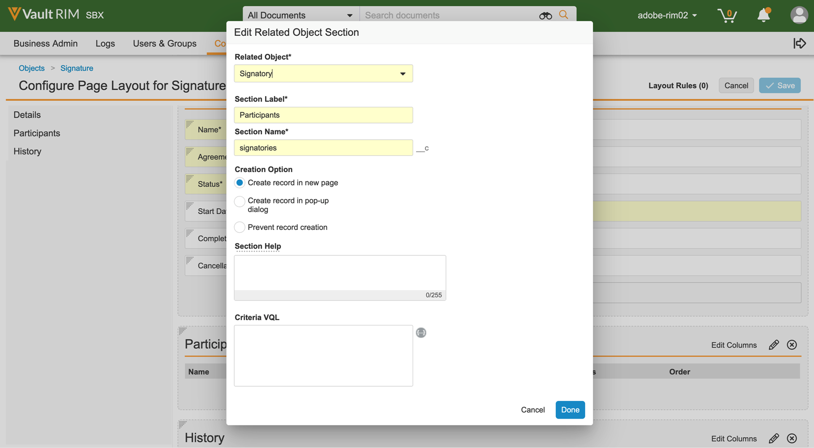

* You can edit the columns to be displayed for the Participants, as shown below.

    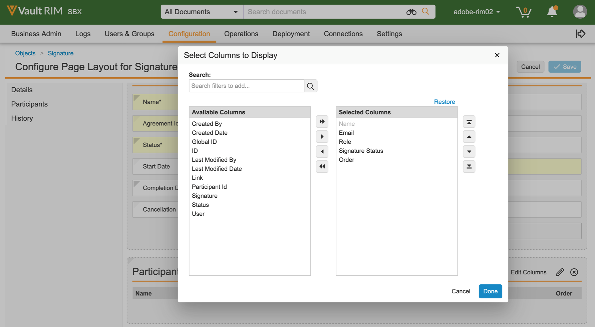

* The *History* section has the Related Objects Section that is configured as shown in the image below.

    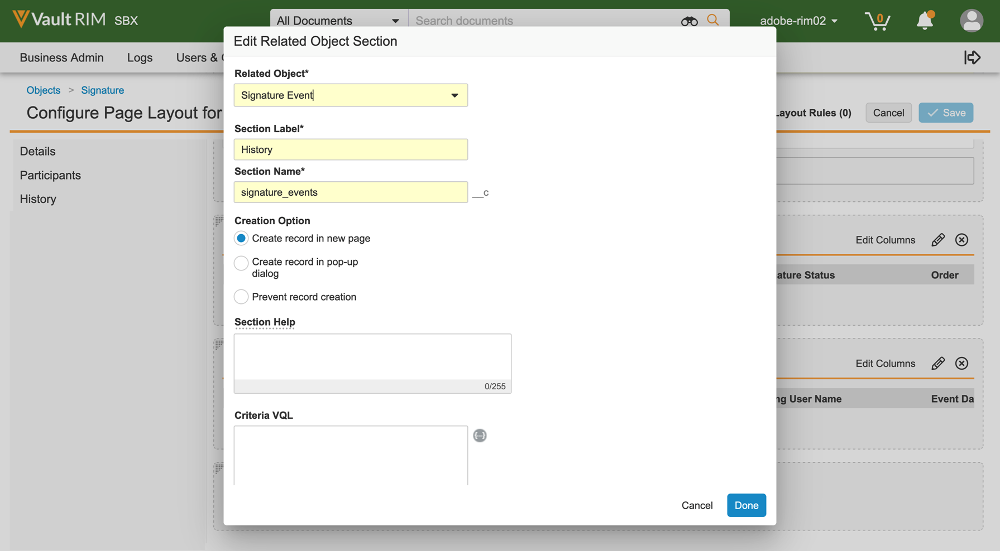

* You can edit the columns to be displayed for the History, as shown below.

    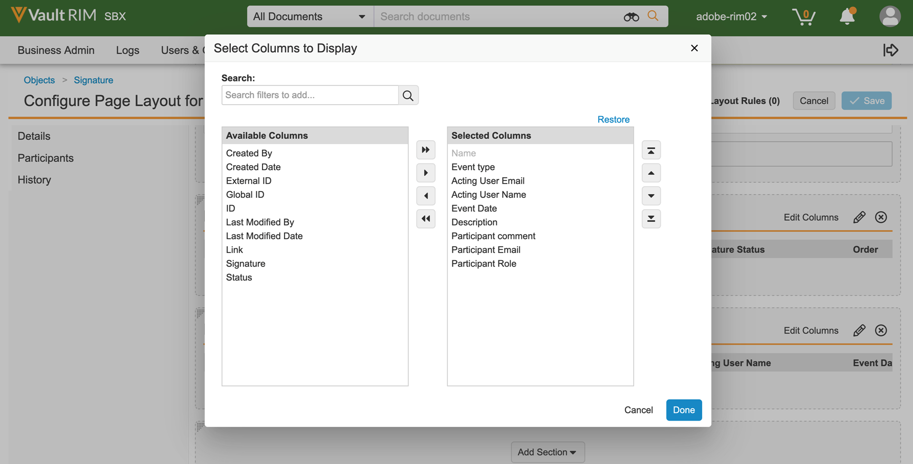

#### **View Participants & Audit History for the Adobe Sign Document** {#view-participants-audit-history}

* To view Participants and Audit history for the Adobe Sign document, select the link in the 'Adobe Signature' section of the document.

    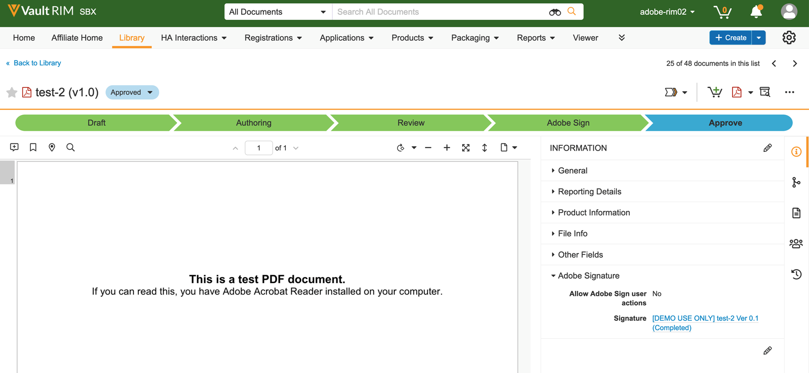

* The page that opens displays the Participants and History for the Adobe Sign document, as shown below.

    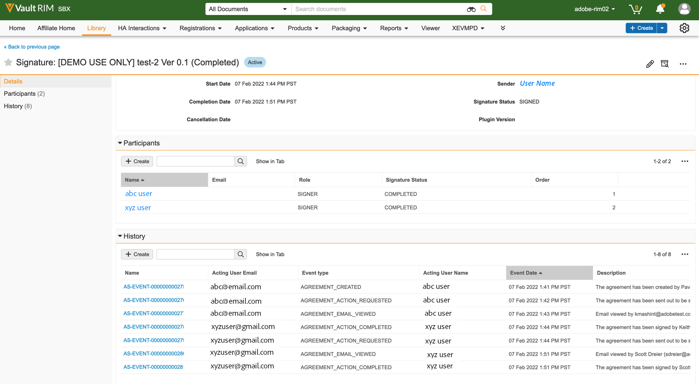

* View the audit trail for Signature as shown below.

    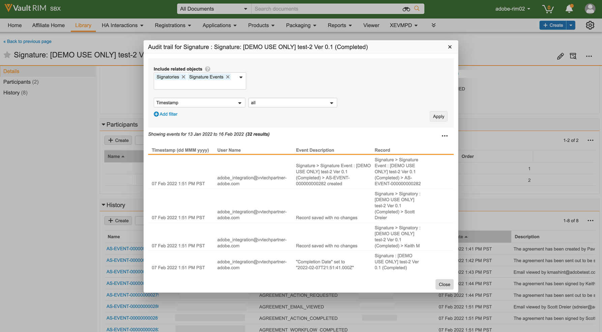

### Step 3. Setup Security profiles {#security-profiles}

Successful package deployment in Step 2 creates Adobe Sign Integration profile. The Adobe Sign Integration Profile is assigned to the system account and is used by the integration when calling Vault APIs. This profile allows permissions for:

* Vault APIs
* Reading, creating, editing, and deleting: Signature, Signatory, Signature Events, and Process Locker objects

You must update the Adobe Sign Admin Group (created in Step 1) by setting the included security profile to Adobe Sign Integration Profile, as shown in the image below.

 

### Step 4. Create User {#create-user}

The Vault system account user of Adobe Sign integration must:

* Have a Adobe Sign Integration Profile
* Have a Security profile
* Have Specific security policy that disables password expiration
* Be a member of Adobe Sign Admin Group.

To do so, follow the steps below:

1. Create Vault system account user of Adobe Sign integration.

    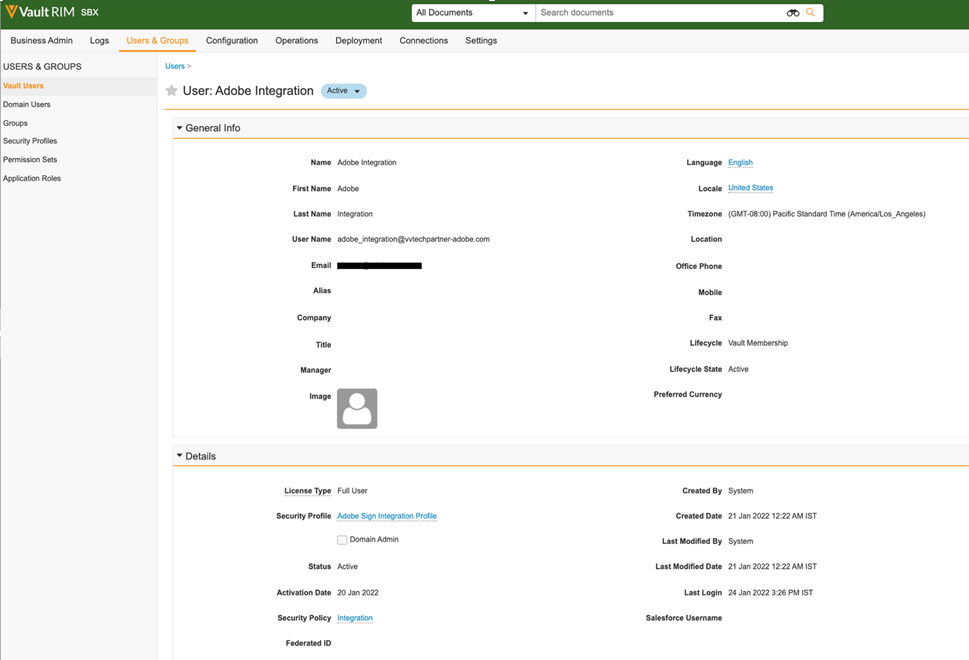

2. Add the user to the Adobe Sign Admin Group.

    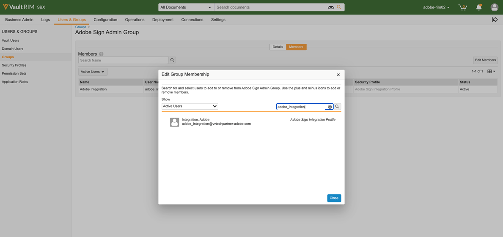

### Step 5. Configure Document Type Group {#create-document-type-group}

When you deploy the Adobe Sign package, it creates a Document Type Group record called 'Adobe Sign Document'. 

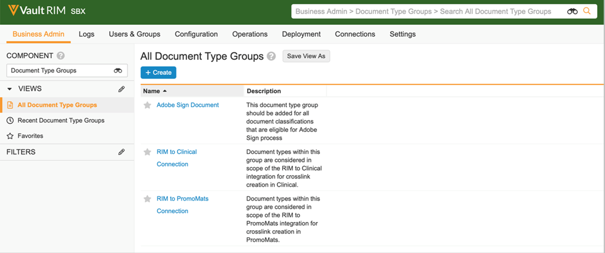

You need to add this document type group for all document classifications that are eligible for Adobe Sign process. Since document type group property is not inherited from type to subtype nor from subtype to classification level, it must be set for each document’s classification that is eligible for Adobe Sign.

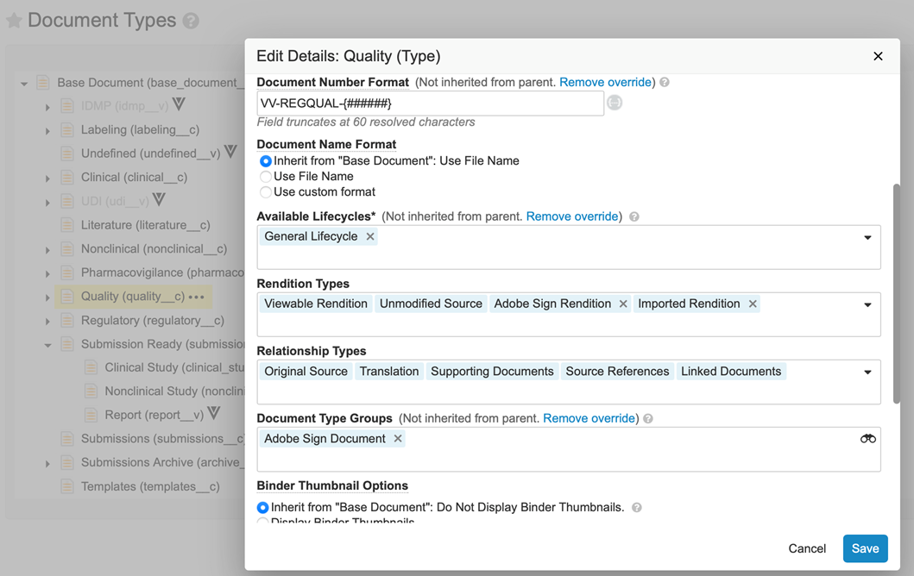

**Note:** If User Role Setup object does not contain the field that refers to Document Type Group object, you must add the field. To do so, go to **[!UICONTROL Object]** > **[!UICONTROL User Role Setup]** > **[!UICONTROL Fields]** and complete the required steps, as shown in the image below.

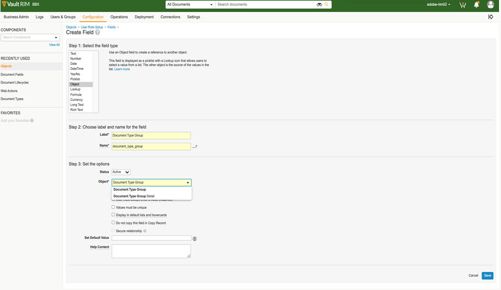

### Step 6. Create User Role Setup {#create-user-role-setup}

Once lifecycle(s) is(are) properly configured, the system should ensure that Adobe Sign Admin user is added by DAC for all documents that are eligible for Adobe Sign process. This is done by creating the appropriate User Role Setup record that specifies:

* Document Type Group as Adobe Sign Document
* Application Role as Adobe Sign Admin Role
* Integration user

### Step 7. Setup Document Fields {#create-fields}

The package deployment creates following two new shared document fields that are required for establishing the integration:

* Signature (signature__c) 
* Allow Adobe Sign user actions (allow_adobe_sign_user_actions__c)

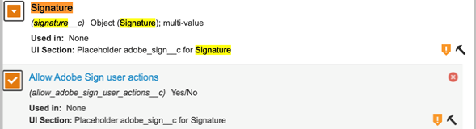

To setup Document Fields:

1. Go to the Configuration tab and select **[!UICONTROL Document Fields]** > **[!UICONTROL Shared Fields]**.
1. In the Display Section field, select **[!UICONTROL Create Display Section]** and assign **[!UICONTROL Adobe Signature]** as the Section label.

    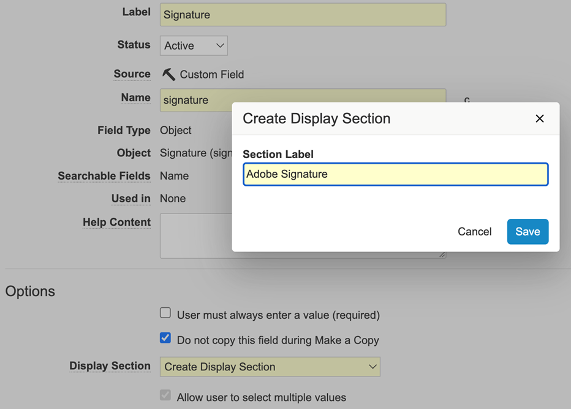

1. For the two shared Document fields (signature__c and allow_adobe_sign_user_actions__c), update the UI section with **[!UICONTROL Adobe Signature]** as the section label.
1. Add the three shared fields to all document types that are eligible for Adobe Signature. To do so, in the Base Dcoument page, select **[!UICONTROL Add]** > **[!UICONTROL Existing Shared Field]** from the top right corner.

    

    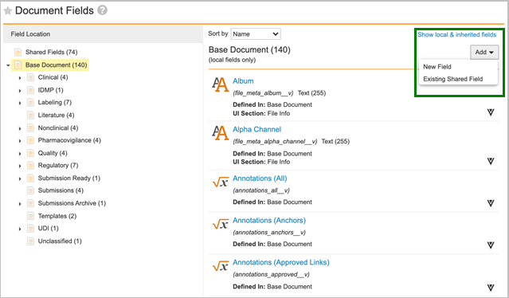

    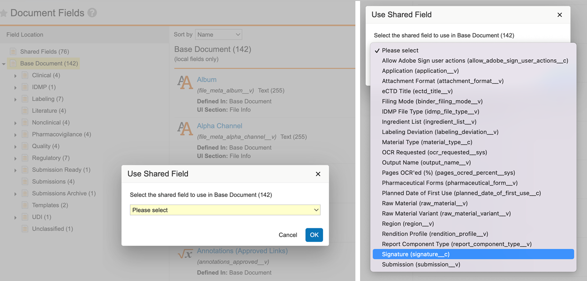

1. Note that both fields must have a specific security that allows only members of Adobe Sign Admin Group to update their values.

    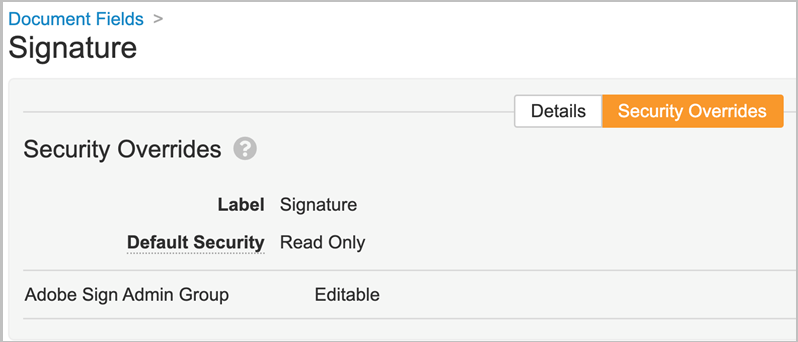

Disable Vault Overlays (disable_vault_overlays__v) is an existing shared field. Optionally, the field can have a specific security that allows only members of Adobe Sign Admin group to update its value.

### Step 8. Declare Document Renditions {#declare-renditions}

The new rendition type called *Adobe Sign Rendition (adobe_sign_rendition__c)* is used by Vault integration to upload signed PDF documents to Adobe Sign. You must declare the Adobe Sign rendition for each document type that is eligible for Adobe Signature.

### Step 9. Update Web Actions {#web-actions}

Adobe Sign and Vault integration requires you to create and configure following two web actions:

* **Create Adobe Sign**: It creates or displays Adobe Sign Agreement.

    Type: Document
    Target: Display within Vault
    Credentials: Enable Post Session credentials via Post Message
    URL: <https://api.na1.adobesign.com/api/gateway/veevavaultintsvc/partner/agreement?docId=${Document.id}&majVer=${Document.major_version_number__v}&minVer=${Document.minor_version_number__v}&vaultid=${Vault.id}&useWaitPage=true>

    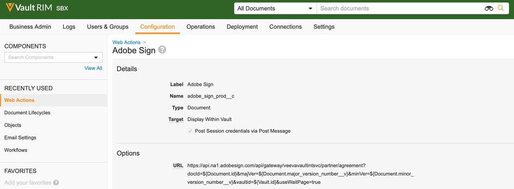

* **Cancel Adobe Sign**: It cancels an existing agreement in Adobe Sign and reverts a document’s state to the initial one.

    Type: Document
    Target: Display within Vault
    Credentials: Enable Post Session credentials via Post Message
    URL: : <https://api.na1.adobesign.com/api/gateway/veevavaultintsvc/partner/agreement/cancel?docId=${Document.id}&majVer=${Document.major_version_number__v}&minVer=${Document.minor_version_number__v}&vaultid=${Vault.id}&useWaitPage=true>

    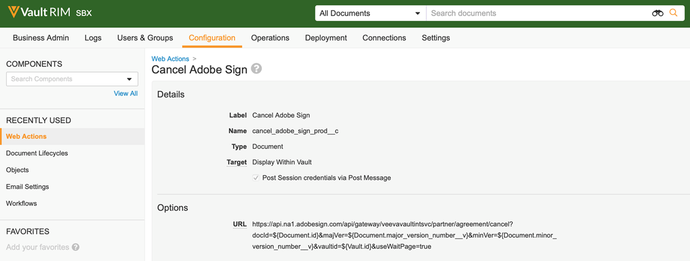

### Step 10. Update document lifecycle {#document-lifecycle}

For each document type eligible for Adobe Signature, you must update corresponding document lifecycle by adding new lifecycle role and states. 

Adobe Sign agreement lifecycle has following states:

* DRAFT
* AUTHORING or DOCUMENTS_NOT_YET_PROCESSED
* OUT_FOR_SIGNATURE or OUT_FOR_APPROVAL
* SIGNED or APPROVED
* CANCELLED
* EXPIRED

To update document lifecycle, follow the steps below:

1. Add Lifecycle role. Adobe Sign Admin application role must be added in all lifecycles used by documents eligible for Adobe Signature, as shown below. 

    

    The admin role should be created with the following options:

    * Enabled Dynamic Access Control.
    * Document sharing rules that include only Document Type Group, as shown in the image below.

    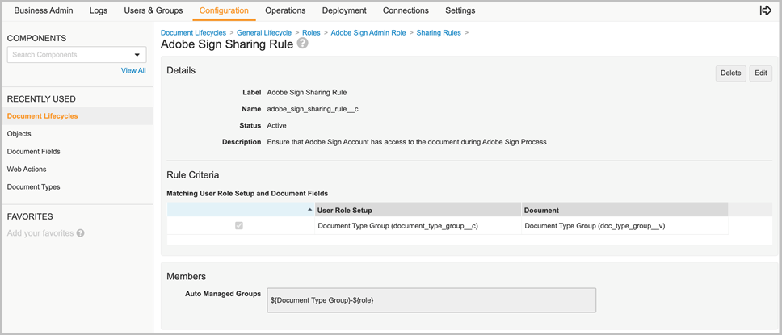

2. Create Lifecycle states. To do so, go to **[!UICONTROL Settings]** > **[!UICONTROL Configuration]** > **[!UICONTROL Document Lifecycles]** > **[!UICONTROL General Lifecycles]** > **[!UICONTROL States]** > **[!UICONTROL Create]**. Next, create the following states:

    * In Adobe Sign Draft

    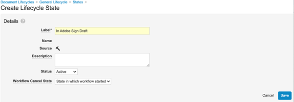

    * In Adobe Sign Authoring

    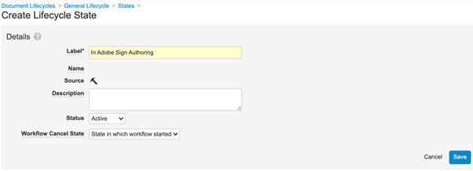

    * In Adobe Signing

    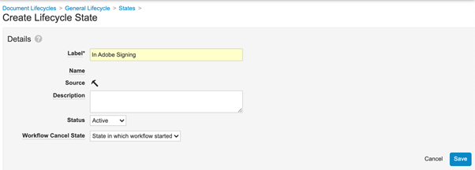

3. Add User Actions to the below listed states. 
   
    When a Vault document is sent to Adobe Sign, its state should correspond to the state in which the agreement is. To do so, add following states in every lifecycle used by documents eligible for Adobe Signature:

    * **Before Adobe Signature** (Reviewed): This is a placeholder name for the state from which document can be sent to Adobe Sign. Based on the document type, it can be Draft state or Reviewed. Document state label can be customized as per the customer’s requirements. Before Adobe Signature state must define following two user actions:

        * Action that changes the state of document to *In Adobe Sign Draft* state. The name of this user action must be the same for all document types for any lifecycle. If necessary, the criteria for this action can be set to “Allow Adobe Sign user actions equals Yes”. 
        * Action that calls the Web Action ‘Adobe Sign’. This state must have security that allows Adobe Sign Admin Role to: view document, view content, edit fields, edit relationships, download source, manage viewable rendition, and change state.

        

    * **In Adobe Sign Draft**: This is a placeholder name for the state that indicates that the document is already uploaded to Adobe Sign and that its agreement is in a DRAFT state. It is a required state. This state must define following five user actions:

        * Action that changes the state of document to *In Adobe Sign Authoring* state. The name of this user action must be the same for all document types for any lifecycle. If necessary, the criteria for this action can be set to “Allow Adobe Sign user actions equals Yes”.
        * Action that changes the state of document to *In Adobe Signing state*. The name of this user action must be the same for all document types for any lifecycle. If necessary, the criteria for this action can be set to “Allow Adobe Sign user actions equals Yes”.
        * Action that changes the state of document to *Adobe Sign Cancelled* state. The name of this user action must be the same for all document types for any lifecycle. If necessary, the criteria for this action can be set to “Allow Adobe Sign user actions equals Yes”.
        * Action that calls the Web Action ‘Adobe Sign’ .
        * Action that calls the Web Action ‘Cancel Adobe Sign’. This state must have security that allowsAdobe Sign Admin role to: view document, view content, edit fields, edit relationships, download source, manage viewable rendition, and change state.

        

    * **In Adobe Sign Authoring**: This is a placeholder name for state that indicates that the document is already uploaded to Adobe Sign and that its agreement is in AUTHORING or DOCUMENTS_NOT_YET_PROCESSED state. It is a required state. This state must have following four user actions defined:

        * Action that changes the state of document to Adobe Sign Cancelled state. The name of this user action must be the same for all document types no matter what lifecycle is. If necessary, the criteria for this action can be set to “Allow Adobe Sign user actions equals Yes”.
        * Action that changes the state of document to In Adobe Signing state. The name of this user action must be the same for all document types no matter what lifecycle is. If necessary, the criteria for this action can be set to “Allow Adobe Sign user actions equals Yes”.
        * Action that calls the Web Action ‘Adobe Sign’ 
        * Action that calls the Web Action ‘Cancel Adobe Sign’. This state must have security that allowsAdobe Sign Admin role to: view document, view content, edit fields, edit relationships, download source, manage viewable rendition, and change state.  

        

    * **In Adobe Signing**: This is a placeholder name for the state that indicates that the document is uploaded to Adobe Sign and that its agreement is already sent to participants (OUT_FOR_SIGNATURE or OUT_FOR_APPROVAL state). It is a required state. This state must have following five user actions defined:

        * Action that changes the state of document to Adobe Sign Cancelled state. The target state of this action can be whatever customer requirement is and it can be different for different types. The name of this user action must be the same for all document types no matter what lifecycle is. If necessary, the criteria for this action can be set to “Allow Adobe Sign user actions equals Yes”.
        * Action that changes the state of document to Adobe Sign Rejected state. The target state of this action can be whatever customer requirement is and it can be different for different types. The name of this user action must be the same for all document types no matter what lifecycle is. If necessary, the criteria for this action can be set to “Allow Adobe Sign user actions equals Yes”.
        * Action that changes the state of document to Adobe Signed state. The target state of this action can be whatever customer requirement is and it can be different for different types. However, the name of this user action must be the same for all document types no matter what lifecycle is. If necessary, the criteria for this action can be set to “Allow Adobe Sign user actions equals Yes”.
        * Action that calls the Web Action *Adobe Sign*.
        * Action that calls Web Action *Cancel Adobe Sign*. This state must have security that allowsAdobe Sign Admin role to: view document, view content, edit fields, edit relationships, download source, manage viewable rendition, and change state.  

        

        * **Adobe Signed (Approved)**: This is a placeholder name for the state that indicates that the document is uploaded to Adobe Sign and that its agreement is completed (SIGNED or APPROVED state). It is a required state and it can be an existing lifecycle state, like Approved.
        This state does not require user actions. It must have security that allows Adobe Sign Admin role to: view documents, view content, and edit fields.

    Following diagram illustrates the mappings between Adobe Sign agreement and Vault document states, where the ‘Before Adobe Signature’ state is Draft. 

    

### Step 11. Add Adobe Sign stage to General Lifecycle in Lifecycle Stage groups

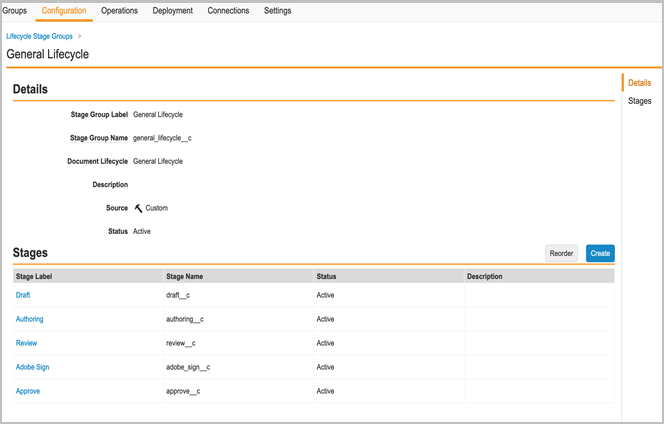

### Step 12. Set permissions for User Role in Lifecycle state

You must set appropriate permissions for each User Role in Lifecycle State, as shown in the image below.

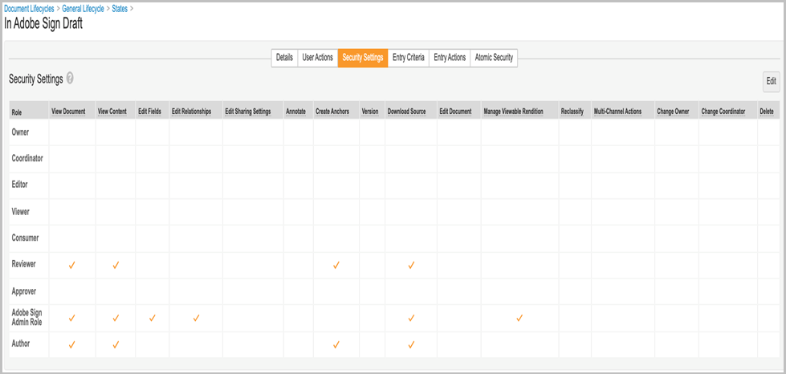

### Step 13. Set up atomic security based on the document state and the user role

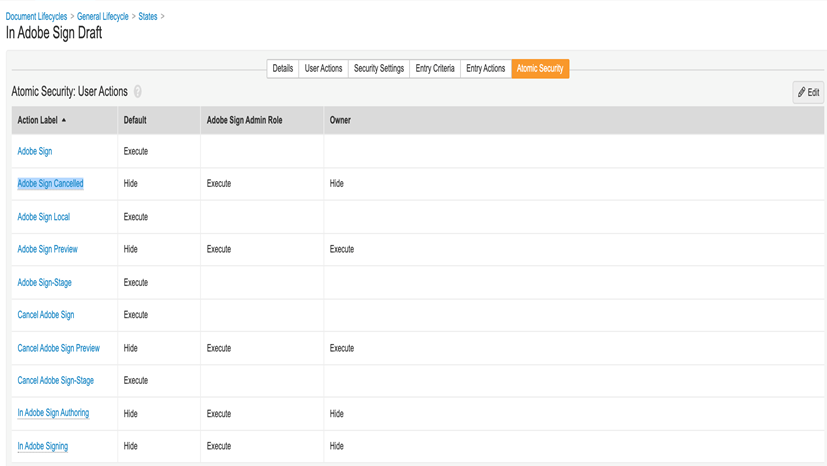

### Step 14. Create Document messages for Adobe Sign Cancel

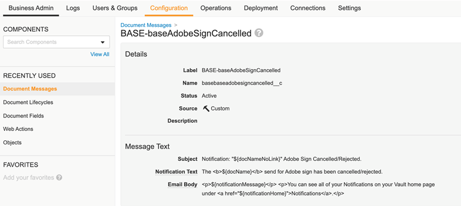

## Connect [!DNL Veeva Vault] to Adobe Sign using middleware {#connect-middleware}

After completing the setup for [!DNL Veeva Vault] and the Adobe Sign Admin account, the administrator must create a connection between the two accounts using the middleware. The [!DNL Veeva Vault] and Adobe Sign account connection is initiated by Adobe Sign Identity and then it is used to store the[!DNL Veeva Vault]identity. 
For system security and stability, the administrator must use a dedicated [!DNL Veeva Vault] system/service/utility account, such as `adobe.for.veeva@xyz.com`, instead of a personal user account, such as `bob.smith@xyz.com`.

An Adobe Sign account administrator must follow the below steps to connect [!DNL Veeva Vault] to Adobe Sign using middleware:

1. Go to the [Adobe Sign for [!DNL Veeva Vault] Home page](https://static.adobesigncdn.com/veevavaultintsvc/index.html).
1. Select **[!UICONTROL Login]** from the top-right corner. 

    

1. In the Adobe Sign login page that opens, provide the account administrator email and password, then select **[!UICONTROL Sign in]**.

    

    After successful signing in, the page displays the associated email id and a Settings tab, as shown below.

    

1. Select the **[!UICONTROL Settings]** tab. 

    The Settings page displays the available connections, and shows *No connections available* in case of first connection setup, as shown below.

    

1. Select **[!UICONTROL Add Connection]** to add a new connection.

1. In the Add Connection dialog that opens, provide the required details including the [!DNL Veeva Vault] credentials. 

    The Adobe Sign Credentials are autopopulated from the initial Adobe Sign login.

    

1. Select **[!UICONTROL Validate]** to validate the account details.

    On successful validation, you see a 'User validated successfully' notification, as shown below. 

    

1. To restrict the usage to a particular Adobe Sign Group, expand the **[!UICONTROL Group]** drop-down list and select one of the available groups.

   

1. To attach audit report to the signed rendition, select the checkbox **[!UICONTROL Attach Audit Report to Signed Rendition]**.

   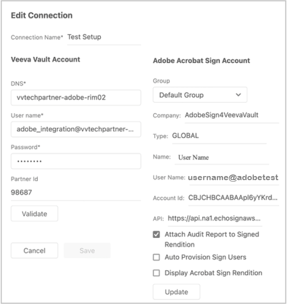

1. To allow auto-provisioning of users in Adobe Sign, select the checkbox **[!UICONTROL Auto Provision Sign Users]**.

    **Note:** Auto Provisioning of new Adobe Sign Users works only if it has been enabled at the Adobe Sign Account Level in Adobe Sign in addition to enabling **[!UICONTROL Auto Provision Sign Users]** for the[!DNL Veeva Vault]Adobe Sign integration as shown below by the Adobe Sign Account Administrator.

   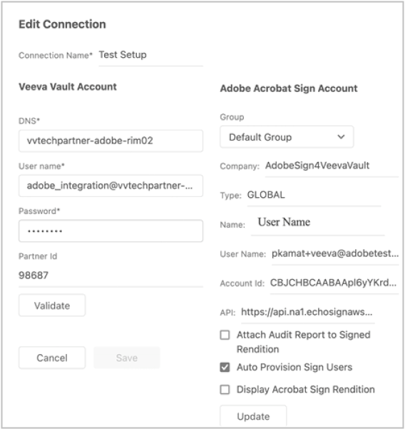

1. Select **[!UICONTROL Save]** to save your new connection.

    The new connection appears under the Settings tab showing successful integration between [!DNL Veeva Vault] and Adobe Sign.

    

