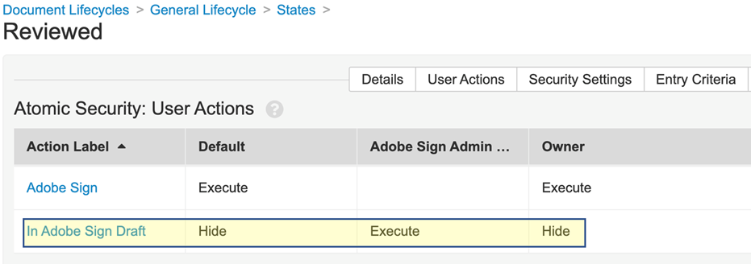
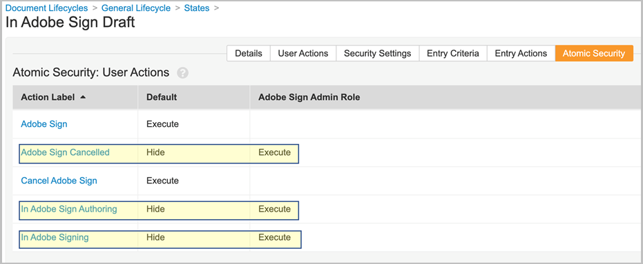

# [!DNL Veeva Vault] Installation Guide{#veeva-installation-guide}

[**Contact Adobe Acrobat Sign Support**](https://adobe.com/go/adobesign-support-center)

## Overview {#overview}

This document explains how to establish integration of Adobe Acrobat Sign with [!DNL Veeva Vault] platform. [!DNL Veeva Vault] is an Enterprise Content Management (ECM) platform built for life sciences. A "Vault" is a content and data repository with typical usage for regulatory filings, research reporting, grants applications, general contracting, and more. A single enterprise can have multiple 'vaults' that must be maintained separately.

The high-level steps to complete the integration are: 

* Activate your Administrative account in Adobe Acrobat Sign (New Customers Only).
* Create objects to track the history of an agreement lifecycle in Vault.
* Create a new Security profile.
* Configure a Group in Adobe Acrobat Sign to hold the [!DNL Veeva Vault] integration user.
* Create document fields and renditions.
* Configure web actions and update the document lifecycle.
* Create document type user and user role setup.
* Connect Veeva Vault to Adobe Acrobat Sign using middleware.

>[!NOTE]
>
>Adobe Sign admin must perform the Adobe Acrobat Sign setup steps within Adobe Acrobat Sign.

## Configure [!DNL Veeva Vault] {#configure-veeva}

To configure [!DNL Veeva Vault] for integration with Adobe Acrobat Sign, you must implement the below listed steps.

### Step 1. Create Group {#create-group}

To configure Adobe Acrobat Sign for [!DNL Vault], a new group called *Adobe Sign Admin Group* is created. This group is used to set the document field level security for Adobe Acrobat Sign related fields and should include *Adobe Sign Integration Profile* by default. 

### Step 2. Deploy the package {#deploy-package}

[Deploy the package](https://helpx.adobe.com/content/dam/help/en/sign-integrations-new/veeva-vault/PKG-AdobeSign-Integration-Veeva.zip) and follow through the steps. Once deployed, the package creates:

* Custom objects: Signature object, Signatory object, Signature Event object, Process Locker object 
* Signature object page layout
* Signature Event object page layout
* Signatory object page layout
* Process Locker object page layout
* Adobe Sign Integration Task Log object page layout
* Adobe Sign Rendition type
* Original Rendition type
* Shared field signature__c 
* Adobe Sign Web Action
* Cancel Adobe Sign Web Action
* Adobe Sign Admin Actions Permission set
* Adobe Sign Integration Profile security profile
* Application role Adobe Sign Admin Role 
* Document type group 'Adobe Sign Document'
* Adobe Sign Integration Task log object

#### Signature object {#signature-object}

Signature object is created to store agreement-related information. A Signature object is a database that contains information under following specific fields:

**Signature object fields**

|Field|Label|Type|Description|
|:---|:---|:---|:------- | 
|external_id__c |Agreement Id|String (100) |Holds the Adobe Acrobat Sign’s unique agreement id|
|file_hash__c |File Hash|String (50) |Holds the md5 checksum of the file that has been sent to Adobe Acrobat Sign|
|name__v|Name|String (128)|Holds the agreement name|
|sender__c  |Sender  |Object (User)  |Holds the reference to the Vault user that has created the agreement|
|signature_status__c  |Signature Status  |String (75) |Holds the agreement’s status in Adobe Acrobat Sign|
|signature_type__c|Signature Type|String (20)|Holds the agreement’s signature type in Adobe Acrobat Sign (WRITTEN or ESIGN)|
|start_date__c|Start Date|DateTime|Date when agreement has been sent for signature|
|cancellation_date__c|Cancellation Date|DateTime|Holds the date when agreement has been cancelled.|
|completion_date__c|Completion Date|DateTime|Holds the date when agreement has been completed.|
|viewable_rendition_used__c|Viewable Rendition Used|Boolean|Flag that indicates if viewable rendition has been sent for signature. (by default, it is true)|
|plugin_version__c|Plugin Version|Text (10)|It is used to allow the appropriate processing of all agreements created before a new version 4.0 is deployed. Note: After 4.0 custom web application version is deployed, this field will be set to 4.0 each time Signature record is created.|
|external_environment__c|External Environment|Text (20)|Holds the Adobe Sign’s environment name in which the agreement has been created.|

 

#### Signatory object {#signatory-object}

Signatory object is created to store information related to the participants in an agreement. It contains information under following specific fields:

**Signatory object fields**

| Field | Label | Type | Description |
|:---|:---|:---|:------- | 
|email__c |Email |String (120) |Holds the Adobe Acrobat Sign’s unique agreement id|
|external_id__c |Participant Id |String (80) |Holds Adobe Acrobat Sign unique participant’s identifier|
|name__v |Name |String (128) |Holds Adobe Acrobat Sign participant’s name|
|order__c |Order |Number |Holds Adobe Acrobat Sign agreement participant’s order number|
|role__c |Role |String (30) |Holds Adobe Acrobat Sign agreement participant’s role|
|signature__c |Signature |Object (Signature) |Holds the reference to the signature parent record|
|signature_status__c |Signature Status |String (100) |Holds Adobe Acrobat Sign agreement participant’s status|
|user__c |User |Object (User) |Holds the reference to the signatory’s user record if participant is a Vault user|

 

#### Signature Event object {#signature-event}

Signature Event object is created to store an agreement's event-related information. It contains information under following specific fields:

Signature Event Object Fields

| Field | Label | Type | Description |
|:---|:---|:---|:-------- | 
|acting_user_email__c|Acting User Email|String|Holds the email of Adobe Acrobat Sign user that performed the action that caused event to be generated|
|acting_user_name__c|Acting User Name|String|Holds the name of Adobe Acrobat Sign user that performed the action that caused event to be generated|
|description__c|Description|String|Holds the Adobe Acrobat Sign event’s description|
|event_date__c|Event Date|DateTime|Holds the Adobe Acrobat Sign event’s date and time|
|event_type__c|Event type|String|Holds the Adobe Acrobat Sign event’s type|
|name__v|Name|String|Auto-generated event name|
|participant_comment__c|Participant comment|String|Holds the Adobe Acrobat Sign participant’s comment if any|
|participant_email__c|Participant Email|String|Holds the Adobe Acrobat Sign participant’s email|
|participant_role__c|Participant Role|String|Holds the Adobe Acrobat Sign participant’s role|
|signature__c|Signature|Object (Signature)|Holds the reference to the signature parent record|
|external_id__c|External ID|Text (200)|Holds Agreement Event identifier generated by Adobe Sign.|

 

#### Process Locker object {#process-locker}

A Process Locker object is created to lock the Adobe Acrobat Sign integration process. It does not require any custom fields.

 

#### Adobe Sign Integration Task Log Object {#task-log}

Create Adobe Sign Integration Task Log (as_int_task_log__c). It is high volume object that is used to trace the execution of AgreementsEventsSynchronizerJob and AgreementsEventsProcessingJob.
AgreementsEventsSynchronizerJob: This task ensures that all missing Agreement Events from Adobe Sign are created as active Signature Events in Vault for all Signatures created in Vault in the past N days.
AgreementsEventsProcessingJob: This task ensures that all Documents with active Signature Event records are processed depending on event type.

Adobe Sign Integration Task Log Object Fields

| Field | Label | Type | Description |
|:--|:--|:--|:---------| 
|start_date__c|Start Date|DateTime|Task Start date|
|end_date__c|End Date|DateTime|Task End date|
|task_status__c|Task Status|Picklist|Holds task status:   Completed (task_completed__c) Completed With Errors (task_completed_with_errors__c) Failed (task_failed__c)|
|task_type__c|Task Type|Picklist|Holds task type:    Agreements Events Synchronization (agreements_events_synchronization__c) Agreements Events Processing (agreements_events_processing__c)|
|messages__c|Message|Long (32000)|Holds task message|

The Signature, Signatory, Signature Event, Process Locker, and Task Log objects that come as a part of the deployment package have the 'Audit data changes for this object' property enabled by default.

**Note:** You can have Vault capture object record data changes in audit logs by enabling the Audit data changes setting. This setting is off by default. Once you enable this setting and create records, you can no longer disable it. If this setting is off and records exist, only a Vault Owner can update the setting.

#### **Display Participants and History for the Signature Object** {#display-participants-history}

The Signature object that comes as a part of the deployment package comes with the [Signature Detail Page Layout](https://vvtechpartner-adobe-rim.veevavault.com/ui/#admin/content_setup/object_schema/pagelayout?t=signature__c&d=signature_detail_page_layout__c). The Page Layout has sections for Participants and History.

* The *Participants* section has the Related Objects Section that is configured as shown in the image below.

    

* You can edit the columns to be displayed for the Participants, as shown below.

    

* The *History* section has the Related Objects Section that is configured as shown in the image below.

    

* You can edit the columns to be displayed for the History, as shown below.

    

#### **View Participants & Audit History for the Adobe Acrobat Sign Document** {#view-participants-audit-history}

* To view Participants and Audit history for the Adobe Acrobat Sign document, select the link in the 'Adobe Signature' section of the document.

    

* The page that opens displays the Participants and History for the Adobe Acrobat Sign document, as shown below.

    

* View the audit trail for Signature as shown below.

    

### Step 3. Setup Security profiles {#security-profiles}

Successful package deployment in Step 2 creates Adobe Sign Integration profile. The Adobe Sign Integration Profile is assigned to the system account and is used by the integration when calling Vault APIs. This profile allows permissions for:

* Vault APIs
* Reading, creating, editing, and deleting: Signature, Signatory, Signature Events, and Process Locker objects

You must update the Adobe Sign Admin Group (created in Step 1) by setting the included security profile to Adobe Sign Integration Profile, as shown in the image below.

 

### Step 4. Create User {#create-user}

The Vault system account user of Adobe Acrobat Sign integration must:

* Have an Adobe Sign Integration Profile
* Have a Security profile
* Have Specific security policy that disables password expiration
* Be a member of Adobe Sign Admin Group.

To do so, follow the steps below:

1. Create Vault system account user of Adobe Acrobat Sign integration.

    

2. Add the user to the Adobe Sign Admin Group.

    

### Step 5. Configure Document Type Group {#create-document-type-group}

When you deploy the Adobe Acrobat Sign package, it creates a Document Type Group record called 'Adobe Sign Document'. 

You must add this document type group for all document classifications that are eligible for Adobe Acrobat Sign process. Since document type group property is not inherited from type to subtype nor from subtype to classification level, it must be set for each document’s classification that is eligible for Adobe Acrobat Sign.

**Note:** If User Role Setup object does not contain the field that refers to Document Type Group object, you must add the field. To do so, go to **[!UICONTROL Object]** > **[!UICONTROL User Role Setup]** > **[!UICONTROL Fields]** and complete the required steps, as shown in the image below.

### Step 6. Create User Role Setup {#create-user-role-setup}

Once lifecycles is(are) properly configured, the system should ensure that Adobe Sign Admin user is added by DAC for all documents that are eligible for Adobe Acrobat Sign process. This is done by creating the appropriate User Role Setup record that specifies:

* Document Type Group as Adobe Sign Document
* Application Role as Adobe Sign Admin Role
* Integration user

### Step 7. Setup Document Fields {#create-fields}

The package deployment creates following new shared document field that are required for establishing the integration:

* Signature (signature__c) 

To set up Document Fields:

1. Go to the Configuration tab and select **[!UICONTROL Document Fields]** > **[!UICONTROL Shared Fields]**.
1. In the Display Section field, select **[!UICONTROL Create Display Section]** and assign **[!UICONTROL Adobe Signature]** as the Section label.

    

1. For the shared Document fields (signature__c), update the UI section with **[!UICONTROL Adobe Signature]** as the section label.
1. Add the two shared fields to all document types that are eligible for Adobe Acrobat Signature. To do so, in the Base Document page, select **[!UICONTROL Add]** > **[!UICONTROL Existing Shared Field]** from the top-right corner.

    

    

    

1. Both fields must have a specific security that allows only members of Adobe Sign Admin Group to update their values.

    

Disable Vault Overlays (disable_vault_overlays__v) is an existing shared field. Optionally, the field can have a specific security that allows only members of Adobe Sign Admin group to update its value.

### Step 8. Declare Document Renditions {#declare-renditions}

The new rendition type called *Adobe Sign Rendition (adobe_sign_rendition__c)* is used by Vault integration to upload signed PDF documents to Adobe Acrobat Sign. You must declare the Adobe Sign rendition for each document type that is eligible for Adobe Acrobat Signature.

The new rendition type called *Original Rendition* (original_rendition__c) is used by the Vault integration as the name of the rendition that should be used to store the original viewable rendition if the signed document is imported as viewable rendition.

You must declare the original rendition for each document type that is eligible for Adobe Acrobat Signature.

Optionally, the vault can have a new rendition type Adobe Audit Trail Rendition (adobe_audit_trail_rendition__c), which is used by Vault integration to store Adobe audit trail report.

Follow the steps below to set up Adobe Audit Trail Rendition:

1. Go to **Rendition Type** > **Create New Rendition Type**. 
    Create the new Rendition Type as Audit Trail Rendition (adobe_audit_trail_rendition__c).

    

1. To view and download the Adobe Audit Trail Rendition for document, declare *Adobe Audit Trail rendition* for each document type that is eligible for Adobe Acrobat Signature.

    

**Note**: You can choose to attach the audit report to the signed rendition by enabling **[!UICONTROL Attach Audit Report to Signed Rendition]** and also display the rendition by enabling ****[!UICONTROL Display Acrobat Sign Rendition]**** options in Admin UI settings.

When a user opts for a digital signature agreement with the above settings, a message (as shown below) is displayed indicating that Adobe Acrobat Sign is using PDF Portfolio for combining digitally signed PDF and audit trail reports.

To view the document content along with the digital signature and Audit Trail, do not select 'Attach Audit Report to Signed Rendition' with 'Display Acrobat Sign Rendition' in Admin UI for digital signature.

You can download or view the Adobe audit trail as a separate rendition from the signed rendition using the "Adobe Audit Trail Rendition" feature.

### Step 9. Update Web Actions {#web-actions}

Adobe Acrobat Sign and Vault integration requires you to create and configure following two web actions:

* **Create Adobe Sign**: It creates or displays Adobe Acrobat Sign Agreement.

    Type: Document
    Target: Display within Vault
    Credentials: Enable Post Session credentials via Post Message
    URL: <https://api.na1.adobesign.com/api/gateway/veevavaultintsvc/partner/agreement?docId=${Document.id}&majVer=${Document.major_version_number__v}&minVer=${Document.minor_version_number__v}&vaultid=${Vault.id}&useWaitPage=true>

    

* **Cancel Adobe Sign**: It cancels an existing agreement in Adobe Acrobat Sign and reverts a document’s state to the initial one.

    Type: Document
    Target: Display within Vault
    Credentials: Enable Post Session credentials via Post Message
    URL: : <https://api.na1.adobesign.com/api/gateway/veevavaultintsvc/partner/agreement/cancel?docId=${Document.id}&majVer=${Document.major_version_number__v}&minVer=${Document.minor_version_number__v}&vaultid=${Vault.id}&useWaitPage=true>

    

### Step 10. Update document lifecycle {#document-lifecycle}

For each document type eligible for Adobe Signature, you must update corresponding document lifecycle by adding new lifecycle role and states. 

Adobe Acrobat Sign agreement lifecycle has following states:

* DRAFT
* AUTHORING or DOCUMENTS_NOT_YET_PROCESSED
* OUT_FOR_SIGNATURE or OUT_FOR_APPROVAL
* SIGNED or APPROVED
* CANCELLED
* EXPIRED

To update document lifecycle, follow the steps below:

1. Add Lifecycle role. Adobe Sign Admin application role must be added in all lifecycles used by documents eligible for Adobe  Acrobat Signature, as shown below. 

    

    The admin role should be created with the following options:

    * Enabled Dynamic Access Control.
    * Document sharing rules that include only Document Type Group, as shown in the image below.

    

2. Create Lifecycle states. To do so, go to **[!UICONTROL Settings]** > **[!UICONTROL Configuration]** > **[!UICONTROL Document Lifecycles]** > **[!UICONTROL General Lifecycles]** > **[!UICONTROL States]** > **[!UICONTROL Create]**. Next, create the following states:

    * In Adobe Sign Draft

    

    * In Adobe Sign Authoring

    

    * In Adobe Signing

    

3. Add User Actions to the below listed states. 
   
    When a Vault document is sent to Adobe Acrobat Sign, its state should correspond to the state in which the agreement is. To do so, add following states in every lifecycle used by documents eligible for Adobe Signature:

    * **Before Adobe Signature** (Reviewed): This is a placeholder name for the state from which document can be sent to Adobe Acrobat Sign. Based on the document type, it can be Draft state or Reviewed. Document state label can be customized as per the customer’s requirements. Before Adobe Signature state must define following two user actions:

        * Action that changes the state of document to *In Adobe Sign Draft* state. The name of this user action must be the same for all document types for any lifecycle. 
        * Action that calls the Web Action ‘Adobe Sign’. This state must have security that allows Adobe Sign Admin Role to: view document, view content, edit fields, edit relationships, download source, manage viewable rendition, and change state.

        

        * Modify *Reviewed* state Atomic Security by setting *In Adobe Sign Draft* by default to Hidden and only Execute for *Adobe Sign Admin Role*.
        
        **Note:** If *Adobe Sign Admin Role* role is not Part of *Atomic Security:User Actions*, Add **[!UICONTROL Adobe Sign Admin Role]** by selecting **[!UICONTROL Edit]**> **[!UICONTROL Role Override]**. Next, add **Adobe Sign Admin Role** for *Reviewed* State.

        
        
        

    * **In Adobe Sign Draft**: This is a placeholder name for the state that indicates that the document is already uploaded to Adobe Acrobat Sign and that its agreement is in a DRAFT state. It is a required state. This state must define following five user actions:

        * Action that changes the state of document to *In Adobe Sign Authoring* state. The name of this user action must be the same for all document types for any lifecycle.
        * Action that changes the state of document to *In Adobe Signing state*. The name of this user action must be the same for all document types for any lifecycle.
        * Action that changes the state of document to *Adobe Sign Cancelled* state. The name of this user action must be the same for all document types for any lifecycle.
        * Action that calls the Web Action *Adobe Sign*.
        * Action that calls the Web Action *Cancel Adobe Sign*. This state must have security that allows Adobe Sign Admin role to: view document, view content, edit fields, edit relationships, download source, manage viewable rendition, and change state.

        

        * Modify *In Adobe Sign Draft* state atomic security: actions *Adobe Sign Cancelled*, *In Adobe Sign Authoring*, *In Adobe Signing* must be hidden for everyone except for Adobe Sign Admin Role
        
        **Note:** If *Adobe Sign Admin Role* is not Part of *Atomic Security: User Actions*, add **[!UICONTROL Adobe Sign Admin Role]** by selecting **[!UICONTROL Edit]** > **[!UICONTROL Role Override]**. Next, add **[!UICONTROL Adobe Sign Admin Role]** role for *In Adobe Sign Draft* State.

        

    * **In Adobe Sign Authoring**: This is a placeholder name for state that indicates that the document is already uploaded to Adobe Acrobat Sign and that its agreement is in AUTHORING or DOCUMENTS_NOT_YET_PROCESSED state. It is a required state. This state must have following four user actions defined:

        * Action that changes the state of document to Adobe Sign Cancelled state. The name of this user action must be the same for all document types no matter what lifecycle is. 
        * Action that changes the state of document to In Adobe Signing state. The name of this user action must be the same for all document types no matter what lifecycle is. 
        * Action that calls the Web Action ‘Adobe Sign’ 
        * Action that calls the Web Action ‘Cancel Adobe Sign’. This state must have security that allowsAdobe Sign Admin role to: view document, view content, edit fields, edit relationships, download source, manage viewable rendition, and change state.  

        

        * Modify *In Adobe Sign Authoring* state atomic security: actions *Adobe Sign Cancelled* and *In Adobe Signing* must be hidden for everyone except for Adobe Sign Admin Role
        
        **Note:** If *Adobe Sign Admin Role* is not Part of *Atomic Security: User Actions*, add **[!UICONTROL Adobe Sign Admin Role]** by selecting **[!UICONTROL Edit]** > **[!UICONTROL Role Override]**. Next, add **[!UICONTROL Adobe Sign Admin Role]** role for *In Adobe Sign Authoring* State.

        

    * **In Adobe Signing**: This is a placeholder name for the state that indicates that the document is uploaded to Adobe Acrobat Sign and that its agreement is already sent to participants (OUT_FOR_SIGNATURE or OUT_FOR_APPROVAL state). It is a required state. This state must have following five user actions defined:

        * Action that changes the state of document to Adobe Sign Cancelled state. The target state of this action can be whatever customer requirement is and it can be different for different types. The name of this user action must be the same for all document types no matter what lifecycle is. 
        * Action that changes the state of document to Adobe Sign Rejected state. The target state of this action can be whatever customer requirement is and it can be different for different types. The name of this user action must be the same for all document types no matter what lifecycle is. 
        * Action that changes the state of document to Adobe Signed state. The target state of this action can be whatever customer requirement is and it can be different for different types. However, the name of this user action must be the same for all document types no matter what lifecycle is. 
        * Action that calls the Web Action *Adobe Sign*.
        * Action that calls Web Action *Cancel Adobe Sign*. This state must have security that allowsAdobe Sign Admin role to: view document, view content, edit fields, edit relationships, download source, manage viewable rendition, and change state.  

        

        * Modify *In Adobe Signing* state atomic security: actions *Adobe Sign Cancelled*, *Adobe Sign Rejected*, and *Adobe Signed* must be hidden for everyone except for Adobe Sign Admin Role
        
        **Note:** If *Adobe Sign Admin Role* is not Part of *Atomic Security: User Actions*, add **[!UICONTROL Adobe Sign Admin Role]** by selecting **[!UICONTROL Edit]** > **[!UICONTROL Role Override]**. Next, add **[!UICONTROL Adobe Sign Admin Role]** role for *In Adobe Signing* State.

        

        * **Adobe Signed (Approved)**: This is a placeholder name for the state that indicates that the document is uploaded to Adobe Acrobat Sign and that its agreement is completed (SIGNED or APPROVED state). It is a required state and it can be an existing lifecycle state, like Approved.
        This state does not require user actions. It must have security that allows Adobe Sign Admin role to: view documents, view content, and edit fields.

    Following diagram illustrates the mappings between Adobe Acrobat Sign agreement and Vault document states, where the ‘Before Adobe Signature’ state is Draft. 

    

### Step 11. Add Adobe Sign stage to General Lifecycle in Lifecycle Stage groups

### Step 12. Set permissions for User Role in Lifecycle state

You must set appropriate permissions for each User Role in Lifecycle State, as shown in the image below.

### Step 13. Set up atomic security based on the document state and the user role

### Step 14. Create Document messages for Adobe Sign Cancel

## Connect [!DNL Veeva Vault] to Adobe Acrobat Sign using middleware {#connect-middleware}

After completing the setup for [!DNL Veeva Vault] and the Adobe Acrobat Sign Admin account, the administrator must create a connection between the two accounts using the middleware. The [!DNL Veeva Vault] and Adobe Acrobat Sign account connection is initiated by Adobe Acrobat Sign Identity and then it is used to store the[!DNL Veeva Vault] identity. 
For system security and stability, the administrator must use a dedicated [!DNL Veeva Vault] system/service/utility account, such as `adobe.for.veeva@xyz.com`, instead of a personal user account, such as `bob.smith@xyz.com`.

An Adobe Acrobat Sign account administrator must follow the below steps to connect [!DNL Veeva Vault] to Adobe Acrobat Sign using middleware:

1. Go to the [Adobe Acrobat Sign for [!DNL Veeva Vault] Home page](https://static.adobesigncdn.com/veevavaultintsvc/index.html).
1. Select **[!UICONTROL Login]** from the top-right corner. 

    

1. To authorize the level of access to the application, select Acrobat Sign OAuth scope as **[!UICONTROL ACCOUNT]** or **[!UICONTROL GROUP]**. Next, select **[!UICONTROL Authorize]**.

    

1. In the Adobe Acrobat Sign login page that opens, provide the account administrator email and password, then select **[!UICONTROL Sign in]**.

    

    After successful signing in, the page displays the associated email id and a Settings tab, as shown below.

    

1. Select the **[!UICONTROL Settings]** tab. 

    The Settings page displays the available connections, and shows *No connections available* in case of first connection setup, as shown below.

    

1. Select **[!UICONTROL Add Connection]** to add a new connection.

1. In the Add Connection dialog that opens, provide the required details including the [!DNL Veeva Vault] credentials. 

    The Adobe Acrobat Sign Credentials are autopopulated from the initial Adobe Sign login.

    

1. Select **[!UICONTROL Validate]** to validate the account details.

    On successful validation, you see a 'User validated successfully' notification, as shown below. 

    

1. To restrict the usage to a particular Adobe Acrobat Sign Group, expand the **[!UICONTROL Group]** drop-down list and select one of the available groups.

   

1. To attach audit report to the signed rendition, select the checkbox **[!UICONTROL Attach Audit Report to Signed Rendition]**.

   

1. To allow auto-provisioning of users in Adobe Acrobat Sign, select the checkbox **[!UICONTROL Auto Provision Sign Users]**.

    **Note:** Auto Provisioning of new Adobe Acrobat Sign Users works only if it has been enabled at the Adobe Acrobat Sign Account Level in Adobe Acrobat Sign in addition to enabling **[!UICONTROL Auto Provision Sign Users]** for the[!DNL Veeva Vault] Adobe Acrobat Sign integration as shown below by the Adobe Acrobat Sign Account Administrator.

   

1. To configure Adobe Sign Rendition to be displayed in Veeva instead of the Original Rendition, select the checkbox **[!UICONTROL Display Acrobat Sign Rendition]**.

   

1. Select **[!UICONTROL Save]** to save your new connection.

    The new connection appears under the Settings tab showing successful integration between [!DNL Veeva Vault] and Adobe Acrobat Sign.

    

