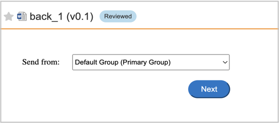
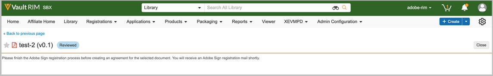
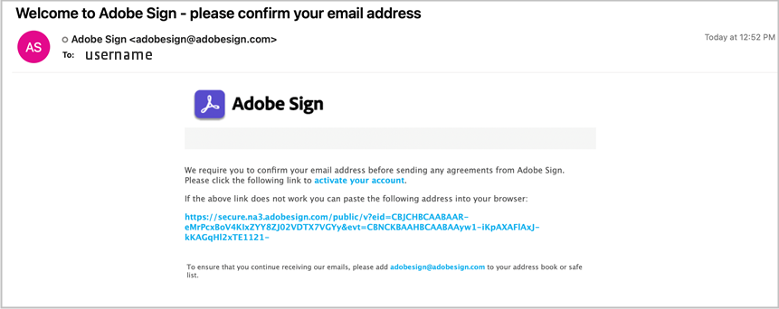
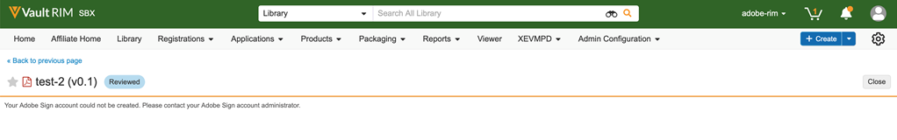

# Adobe Acrobat Sign for [!DNL Veeva Vault]: User Guide {#veeva-vault-user-guide}

[**Contact Adobe Acrobat Sign Support**](https://adobe.com/go/adobesign-support-center)

This document is designed to help [!DNL Veeva Vault] customers learn how to use Adobe Acrobat Sign for [!DNL Veeva Vault] integration for sending an agreement. 

## Overview {#overview}

Adobe Acrobat Sign integration with [!DNL Veeva Vault] facilitates the process of obtaining a signature or approval for any documentation that requires legal signatures or auditable document processing.

The overall process of sending documents for signature is similar to sending an email, so it is easy to adopt for most users.

Adobe Acrobat Sign integration with [!DNL Veeva Vault] streamlines and expedite your document and signature workflows. By using the integration workflow, you:

* Save time and resources spent on snail mails, overnighting, or faxing.
* Send contracts for e-signature or approval from [!DNL Veeva Vault], access real-time contract history, and view saved contracts.
* Track the deals in real time across your organization and get updates when agreements are viewed, signed, canceled, or declined.
* eSign in over 20 languages and support fax-back service in 50+ locales worldwide.
* Create reusable Agreement Templates for sending options.

## Send an Agreement using Adobe Acrobat Sign for [!DNL Veeva Vault] {#send-sign-vault-agreement}

To send an agreement using Adobe Acrobat Sign for Veeva:

1. Go to the [[!DNL Veeva Vault] login page](https://login.veevavault.com/) and enter your username and password. It opens your Vault's home page, as shown below.

    

1. Select **[!UICONTROL Library]** tab and then select **[!UICONTROL Create]** from the top-right corner.

    

1. Select **[!UICONTROL Upload and Continue]**.

1. Upload any document from your local drive.

1. In the dialog that appears, select **[!UICONTROL Type]** as *[!UICONTROL Clinical]* and then select a **[!UICONTROL Subtype]** and **[!UICONTROL Classification]**, if required. 

    

1. To close the dialog, select **[!UICONTROL Ok]**.

1. Select **[!UICONTROL Next]**.

1. In the window that shows, fill in all the required fields in the metadata section and select **[!UICONTROL Save]**.

    

1. It creates a test document in **[!UICONTROL Draft]** status, as displayed below.

    

1. From the top-right corner, select  dropdown menu and select **[!UICONTROL Start Review]**.

    

1. Select the **[!UICONTROL Reviewer]** and **[!UICONTROL Review Due Date]**.

1. Select **[!UICONTROL Start]**. It changes the document Status to [!UICONTROL IN REVIEW].

    

1. Complete the assigned task on behalf of the reviewers. Once you are done, it changes the document Status to [!UICONTROL REVIEWED].

    

1. Select  dropdown menu and select **[!UICONTROL Adobe Sign]**.

    

1. If UMG (Users in Multiple Groups) feature is enabled on the Adobe Acrobat Sign account and the sender belongs to multiple groups, you see a dialog as shown below. In the dialog, select the group and then select **[!UICONTROL Next]**.

    

1. In the iFrame window that opens in Vault, enter the recipient's email address and select **[!UICONTROL Next]**.

    

    **Note:** If an Adobe Acrobat Sign user account does not exist for the sender’s email, the iFrame window displays a message, as shown below. It also sends the user an email with the instructions to activate the account.

    

    

    However, if *Auto Provision Sign Users* feature is disabled, Adobe Acrobat Sign user creation fails, and the iFrame window displays a message asking the user to contact their Adobe Acrobat Sign account administrator. The Adobe Acrobat Sign Account Administrator can take one of the following actions:

    * Enable the *Auto Provision Sign Users* feature for the account.
    * Create the user in Adobe Acrobat Sign prior to using the Veeva Vault Adobe Acrobat Sign Integration.

    

1. Once the document is processed, drag and drop the Signature fields from the right panel and select **[!UICONTROL Send]**.  

    

1. It sends the document to the recipients for signature. Once the recipient receives the document email, the document status changes from [!UICONTROL Reviewed] to [!UICONTROL In Adobe Signing].

    

1. Once all the signatures are captured and completed in Adobe Acrobat Sign, the document Status in Vault changes to [!UICONTROL Approved].

1. Select **[!UICONTROL Document Files]** option and expand the **[!UICONTROL Renditions]** section in Vault. It automatically creates a Rendition called 'Adobe Sign Rendition' once the document is in Approved state. 

    

1. Download the Adobe Sign Rendition for validating the recipient signature.

    

## Cancel an Agreement using Adobe Acrobat Sign for [!DNL Veeva Vault] {#cancel-sign-vault-agreement}

1. Go to the [[!DNL Veeva Vault] login page](https://login.veevavault.com/) and enter your username and password. It opens your Vault's home page, as shown below.

    

1. Select **[!UICONTROL Library]** tab and then select the document. The document status can be: [!UICONTROL In Adobe Sign Draft], [!UICONTROL In Adobe Sign Authoring], or [!UICONTROL In Adobe Signing].

    

1. Select **[!UICONTROL Cancel Adobe Sign]**.

    

1. It triggers the Web Action and loads the iFrame window in [!UICONTROL Vault].

   

1. The document status automatically changes to [!UICONTROL Review].

    

After the document status changes to Review, you can again send it out for signature.
