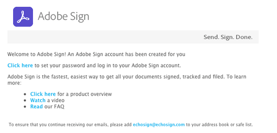

# Workday Installation Guide{#workday-installation-guide}

[**Contact Adobe Sign Support**](https://adobe.com/go/adobesign-support-center)

## Overview {#overview}

This document explains how to integrate Adobe Sign into your Workday tenant. To use Adobe Sign within Workday, you need to know how to create and modify Workday items such as:

* Business process framework
* Tenant set-up and configuration
* Reporting and Workday studio integration

The high-level steps to complete the integration are: 

* Activate your Administrative account in Adobe Sign (New Customers Only)
* Configure a Group in Adobe Sign to hold the Workday integration user
* Establish the OAuth relationship between Workday and Adobe Sign

## Activate your Adobe Sign account {#activating-your-adobe-sign-account}

Existing customers with established accounts can skip to the [Configure Adobe Sign for Workday](#config) topic.

For customers who are new to Adobe Sign and do not have a pre-existing log-in, an Adobe on-boarding specialist provisions your account (in Adobe Sign) for Workday. Once complete, you receive a confirmation email as shown below.

You need to follow the directions in the email to initialize your account and access your Adobe Sign *Home* page.

 

## Configure Adobe Sign for Workday {#config}

To configure Adobe Sign for Workday, you need to generate following two dedicated objects in the Adobe Sign system:

* **A Workday group**: Workday requires a dedicated “group” within the Adobe Sign account to enable integration functionality. The Adobe Sign group is used to control only the Workday usage of Adobe Sign. Any other potential usage, such as Salesforce.com or Arriba is not impacted. The email notifications are suppressed in Workday group so that the Workday users only receive notifications within their Workday inbox.

* **An authenticating user to hold the integration key**: A Workday group must have only one group level administrator, who is the authoritative holder of the integration key. We recommend that the administrator use a functional email address such as **HR@MyDomain.com** instead of a personal email to reduce the risk of having the user disabled in future and consequently disabling the integration.

### Create a user and group in Adobe Sign {#create-a-user-and-group-in-adobe-sign}

To create a user in Adobe Sign:

1. Log in to Adobe Sign as the account administrator.
1. Navigate to **Account > Users**.
1. Click the **circled plus sign** to create a new user. 

    

1. In the dialog that opens, provide the new user details:

    * Provide a functional email that you can access.
    * Enter an appropriate First and Last name value.
    * Select **Create a new group for this user** from the User Group.    
    * Provide the *New Group Name* with an intuitive name like “Workday”.

    

1. Click **Save**.

    It brings you back to the *Users* page that lists the new user with a **CREATED** status. 

    

To verify the email address of the user with “Created” status:

1. Log in to the new user’s email.
2. Find the “Welcome to Adobe Sign” email.
3. Click where it says **Click here to set your password**.
4. Set the password.

Once you verify the email address, the status of the user changes from "CREATED" to "ACTIVE".

 

### Define the authenticating user {#define-the-authenticating-user}

To promote the new user in the Workday group:

1. Navigate to the *Users* page (if not already there).
2. Double-click the user in the Workday group.

    This opens an *Edit* page for the user permissions.

3. Check the **Group Admin**.
4. Click **Save**.

 

## Configure the Workday tenant {#configure-workday}

To complete the connection between the Workday tenant and Adobe Sign, we need to establish a trusted relationship between the services. Once done, we can add a Review Document step that enables the signature process through Adobe Sign.

>[!NOTE]
>
>Adobe Sign is branded as Adobe Document Cloud throughout the Workday environment.

To establish the trusted relationship:

1. Log in to Workday as an account administrator.
1. Search for Edit Tenant Setup - Business Processes.

    It loads the *Edit Tenant Setup - Business Processes* page.

1. Locate the eSignature Configuration section:

    

1. Click **Authenticate with Adobe**.

    This starts the OAuth2.0 authentication sequence.

1. When asked, provide the credentials for the Adobe Sign Group admin that you created earlier.
1. Approve the access to Adobe Sign.

>[!NOTE]
>
>Make sure that you completely log out of any other Adobe Sign instance before proceeding.

Once connected, the Adobe configuration enabled checkbox is set and you can begin using Adobe Sign with Workday.

### Configure the review document step {#configure-review}

The document for the Review Document step can be either one of the following:

* A static document
* A document generated by a Generate Document step within the same business process
* A formatted report created with the Workday Report Designer

You may add any of these docs with [Adobe Text Tags](https://adobe.com/go/adobesign_text_tag_guide) to control the look and position of the Adobe Signing specific components. The document source must be specified within the business process definition. It is not possible to upload an ad-hoc document while the business process is executing.

Unique to using Adobe Sign with a Review Document step is the ability to have serialized Signer Groups. This allows you to specify role-based groups that sign in sequence. Adobe Sign does not support parallel signing groups.

For assistance configuring the Review Document step, refer to the [Quick Start guide](https://experienceleague.adobe.com/docs/dc-sign-integrations/using/workday/quick-start.html?lang=en){target="_blank"}.  

## Support {#support}

### Workday support {#workday-support}

Workday is the integration owner, and should be your first point of contact for questions about the scope of the integration, feature requests, or problems in day to day function of the integration.

You may refer to the following Workday community articles on how to troubleshoot the integration and generate documents:

* [Troubleshoot eSignature integrations](https://doc.workday.com/#/reader/3DMnG~27o049IYFWETFtTQ/zhA~hYllD3Hv1wu0CvHH_g)
* [Review documents step](https://doc.workday.com/#/reader/3DMnG~27o049IYFWETFtTQ/TboWWKQemecNipWgxLAjqg)
* [Dynamic document generation](https://community.workday.com/saml/login?destination=/articles/176443)
* [Offer document generation tips](https://community.workday.com/node/183242)

### Adobe Sign support {#adobe-sign-support}

Adobe Sign is the integration partner, and should be contacted if the integration is failing to obtain signatures, or if notification of pending signatures fails.

Adobe Sign Customers should contact their Customer Success Manager (CSM) for support. Alternatively, Adobe Technical Support can be reached by phone: 1-866-318-4100, wait for product list then enter: 4 and then 2 (as prompted).

* [Adding Adobe text tags to documents](https://adobe.com/go/adobesign_text_tag_guide)  
* [Review document configuration and examples](https://experienceleague.adobe.com/docs/dc-sign-integrations/using/workday/quick-start.html?lang=en){target="_blank"}

## Common questions {#faq}

### Why is the status not being updated within Workday even when the document is fully signed? {#why-is-the-status-not-being-updated-within-workday-even-the-document-is-fully-signed}

The document status in Workday may not reflect if the candidate does not click the 'Submit' button after signing in Adobe Sign. 

As per Workday task Check eSignature Signing Status: To start the process, the user can submit the associated Inbox task.

As per Workday Development: The original signing completes the process only if the user submits the inbox task after signing the document. After signing, the iframe is closed and the user is redirected to the same task where they can click the submit button to complete the process.
