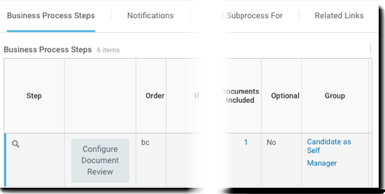
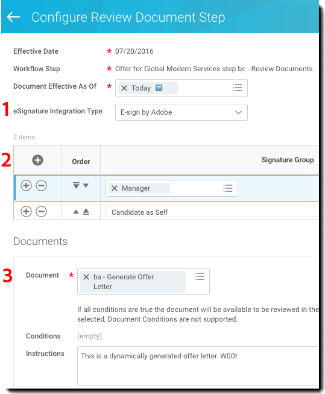
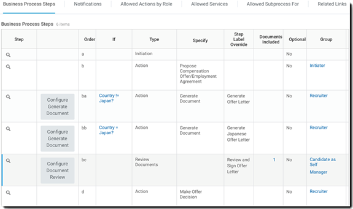
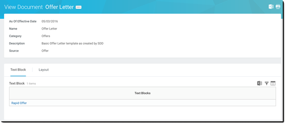
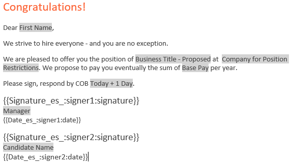
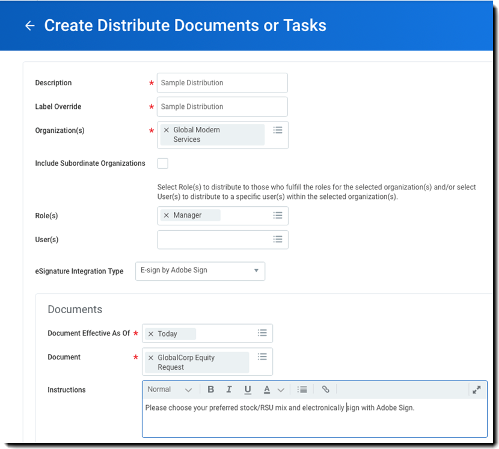
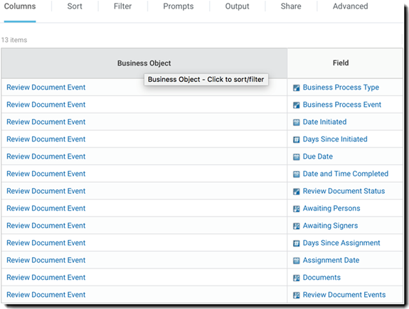
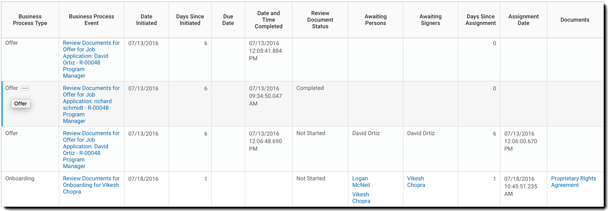
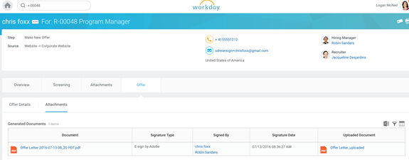

# Workday Quick Start Guide{#workday-quick-start-guide}

[**Contact Adobe Sign Support**](https://adobe.com/go/adobesign-support-center)

## Overview {#overview}

This document is designed to help Workday administrators understand how to customize the Workday Business Processes to include Adobe Sign for obtaining e-signatures. To use Adobe Sign within Workday, you need to know how to create and modify Workday items such as:

* Business Process Framework
* Tenant Set-up and configuration
* Reporting and Workday Studio Integration

## Accessing Adobe Sign within Workday {#access-adobe-sign}

Adobe Sign electronic signature capability is surfaced as ‘Review Document step’ action within the Business Process Framework (BPF) and as a Distribute Documents task.

## Review document step {#review-document-step}

Adobe Sign for Workday is exposed via the *Review Document step* that you can add to any of over 400 Business Processes within Workday, including *Offer*, *Distribute Documents and Tasks*, *ropose Compensation*, and more.

You may refer to the [Workday community articles on *Review Document* step](https://doc.workday.com/#/reader/3DMnG~27o049IYFWETFtTQ/TboWWKQemecNipWgxLAjqg).

There is a 1:1 relationship between *Review Document* steps and billable transactions with Adobe Sign. You can combine multiple documents within a single *Review Document* step and they are presented as a single package for signature. 

**Note**: Only a single *dynamic* document can be referenced within a specific *Review Document* step.

To define a functional Review Document step:

1. Insert a **Review Document** step.
1. Specify the Groups (roles) that can act upon the Review Document step.

To configure the Document Review step:

1. Specify the *eSignature Integration type* as *eSign by Adobe*.

1. Add rows to the Signature Grid.

    * The signature grid specifies the serial order in which the document is routed for signature. Each row can contain one or more roles and each row represents a step in the signing process.
    * Every member of the role within a particular step is notified that a signing event is pending.
    * Once a single person from the role signs, the row step is completed and the document is moved to the next row step.
    * When all rows have been signed, the Review Document step is complete.

1. Specify the document to be signed. If this is an Offer BP, you can use the document from a Generate Document step. Otherwise, choose an existing document or report.

1. Repeat step 3 for as many documents as you require.

    

1. Optionally, add a ‘redirect user’ for capturing ‘decline to sign’ actions. When users decline, Workday reroutes the documents to a configured security group for review.

From the related actions menu of a *Review Documents* step, select **Business Process &gt; Maintain Redirect**. Next, select one of the following:

* **Send Back**: To enable security group members to send a step back to a prior step in the business process. The business process restarts from that step.
* **Move to Next Step**: To enable security group members to forward a step to the next step in the business process.
* **Security Groups**: To redirect steps in the business process flow. Security groups that display at this prompt are selected in the business process security policy in the *Redirect* section.

## Business process step notes {#business-process-step-notes}

The Business Process Framework is powerful; however, you need to ensure that:

* Every Business Process must have a completion step, which is ideally at the end of the business process.

* A completion step is set off of the related actions menu of the search icon. This is possible only while “viewing” the BP and not while “editing” it.

* Every step of the business process is executed sequentially.

    You can change the order of a step by changing the order value. For instance, to insert a step between items “c” and “d”, specify a new item as “ca”.

### Example: offer {#example-offer}

The Offer BP is a subprocess of the Job Application Dynamic BP that needs to be configured to execute the Offer BP. It is triggered when the Job Application state is moved to “Offer” or “Make Offer”.

In the below example, a Review Document step is using a Dynamic Document step for both North America and Japan.

This BP does the following:

* Asks the initiator of the BP to propose compensation for the candidate (step b).
* Uses a step condition to test whether the current country is NOT Japan.

    If true, it executes step “ba” which uses an English language document.
    
    If false, it executes step “bb” which uses a Japanese language document.

* Defines the signature process in the Document Review step “bc”.
* Defines the decision point to make an offer in the required completion step “d”.

The Dynamic document being generated in step “ba” is called *Offer Letter* and contains a single text block named *Rapid Offer*. You can add multiple text blocks such as header, salutation, compensation, stock, closing, terms, and more as required.

The Dynamic offer letter below is created in the Workday rich text editor. The items highlighted in *gray* are Workday provided objects that reference contextual data.

Items in {{brackets}} are [Adobe Text tags](https://adobe.com/go/adobesign_text_tag_guide).

Within the *Review Document* step, the dynamic document is referenced from the previous step and defines the sequential signature process via two signing groups.

The behavior illustrated below will route the dynamically generated document first to the Hiring Manager, and then to the Candidate.

 

### Example: Distribute documents {#example-distribute-documents}

Introduced in Workday 30, the Mass Distribute Documents or Tasks task can be used to send a single document to a large group (&lt;20K) of individual signers. It is limited to a single signature per document. Creation of a distribution is performed by accessing the ‘Create Distribute Documents or Tasks’ action from the search bar.

Example: Send an employee equity choice form to all managers with Global Modern Services. You can further filter it to individual managers, if desired.

You can also access the **View Distribute Documents or Tasks** report to track the progress of the distribution.

 

### Example: Reporting {#example-reporting}

Workday has a rich reporting infrastructure. To look at the details of the Adobe Sign process, inspect the elements of the *Review Document Event*.

Below is a simple custom report that can be run across all BPs looking for Adobe Sign transactions and their status.

The following report was generated by looking at *Offer*, *Onboarding*, and *Propose Compensation* BPs within an implementation tenant.

You can see:

* The documents out for signature
* The associated BP step
* The next person awaiting signature

 

## Signed documents {#signed-documents}

The Workday signature cycle suppresses all email notifications by Adobe Sign. Users are informed of pending actions within their Workday inbox.

Once a document is signed by all Signature Groups, a copy of the signed document is distributed to all the members of the Signature Group via email.

To suppress this behavior, you may contact your Adobe Sign Success Manager or the [Adobe Sign Support team](https://adobe.com/go/adobesign-support-center).

Within Workday, you can access the signed documents on the full process record. You may find:

* Worker documents on the Worker Profile, and
* Candidate documents (offer letters) on the Candidate profile.

The below image shows a signed offer letter for the candidate Chris Foxx. 

 

## Support {#support}

### Workday support {#workday-support}

Workday is the integration owner, and should be your first point of contact for questions about the scope of the integration, feature requests, or problems in day to day function of the integration.

The workday community has several good articles on how to troubleshoot the integration and generate documents:

* [Troubleshoot eSignature Integrations](https://doc.workday.com/#/reader/3DMnG~27o049IYFWETFtTQ/zhA~hYllD3Hv1wu0CvHH_g)
* [Review Documents Step](https://doc.workday.com/#/reader/3DMnG~27o049IYFWETFtTQ/TboWWKQemecNipWgxLAjqg)  
* [Dynamic Document Generation](https://community.workday.com/node/176443)
* [Offer Document Generation Configuration tips](https://community.workday.com/node/183242)

### Adobe Sign support {#adobe-sign-support}

Adobe Sign is the integration partner, and should be contacted if the integration is failing to obtain signatures, or if notification of pending signatures fails.

Adobe Sign Customers should contact their Customer Success Manager (CSM) for support. Alternatively, Adobe Technical Support can be reached by phone: 1-866-318-4100, wait for product list then enter: 4 and then 2 (as prompted).

* [Adding Adobe Text Tags to Documents](https://adobe.com/go/adobesign_text_tag_guide)

<!--
[Download PDF](images/adobe-sign-for-workday-quick-start-guide-2016.pdf)
-->