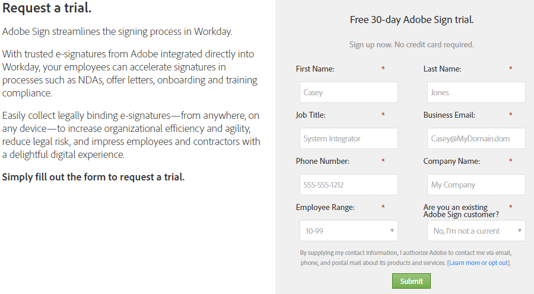
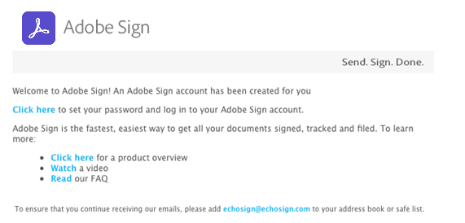
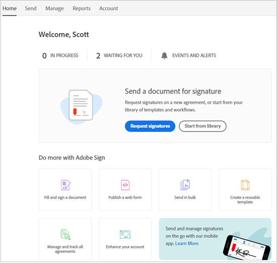
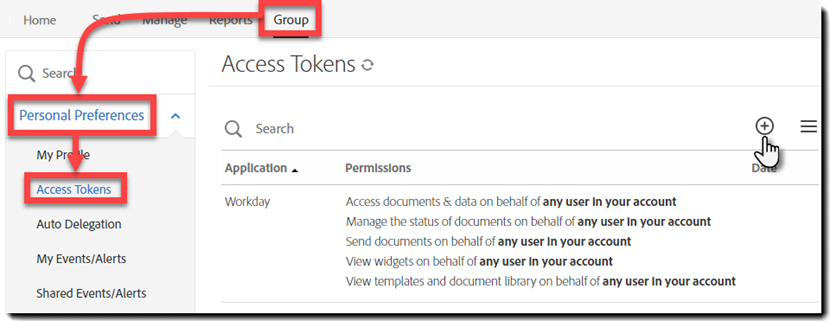
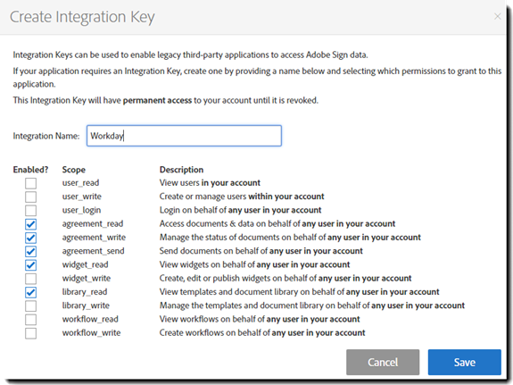
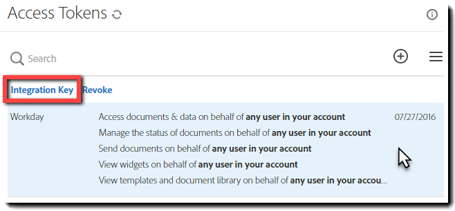
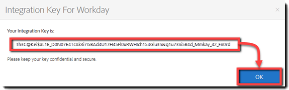
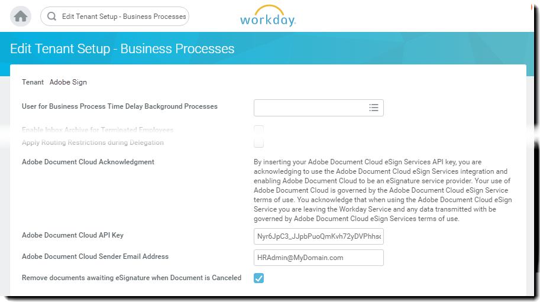
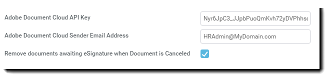

# [!DNL Workday] Trial Installation{#workday-trial-installation}

## Overview {#overview}

This document is designed to help [!DNL Workday] customers learn how to activate a trial account with Adobe Sign and then integrate it into [!DNL Workday] tenant. To use Adobe Sign within [!DNL Workday], you must know how to create and modify [!DNL Workday] items such as:

* Business process framework
* Tenant set-up and configuration
* Reporting and [!DNL Workday] Studio integration

**Note**: If you have an existing Adobe Sign account, there is no must start a trial. You may contact your Client Success Manager to request [!DNL Workday] integration.

The high-level steps to complete integration are:

* Activate your trial account with Adobe Sign
* Generate an integration key in Adobe Sign
* Install the integration key into the [!DNL Workday] Tenant

## Activate your Adobe Sign trial account {#activate-sign-trial-account}

To request a 30-day trial of Adobe Sign, you must fill this [registration form](https://land.echosign.com/esign-trial-workday-registration.html).

**Note**: We strongly recommend that you use a valid functional email address to create the trial and not a temporary email. You must access this email to verify the account, so the address must to be valid.

Within one business day, an Adobe Sign on-boarding specialist provisions your account (in Adobe Sign) for [!DNL Workday]. Once complete, you receive a confirmation email as shown below.

To initialize your account and access your Adobe Sign [!UICONTROL Home] page, follow the directions in the email .

 

## Generate an integration key {#generate-an-integration-key}

For new installations, you must generate an integration key in Adobe Sign and then enter it into [!DNL Workday]. This key authenticates the Adobe Sign and [!DNL Workday] environments to trust each other and share content.

To generate an Integration Key in Adobe Sign:

1. Log in to your administrator in Adobe Sign.
1. Navigate to **[!UICONTROL **Account]** &gt; **[!UICONTROL Personal Preferences]** &gt; **[!UICONTROL Access Tokens**]**.
1. Click the **circled plus icon** on the right side of the window.
   
   It opens the [!UICONTROL Create Integration Key] interface.

    

1. Provide an intuitive name for your key, such as [!DNL Workday].

    The Integration Key must have the following elements enabled:

    * agreement_read
    * agreement_write
    * agreement_send
    * widget_read
    * library_read

    

1. Click **[!UICONTROL Save]**.

    The [!UICONTROL Access Tokens] page is exposed showing the keys designed in your account.

1. Click the key definition created for [!DNL Workday].

    The [!UICONTROL Integration Key] link is exposed at the top of the definition.

1. Click the **[!UICONTROL Integration Key]** link.

    It exposes the integration key.

    

1. Copy this key and save in a secure place for the next step.
1. Click **[!UICONTROL OK]**.

     

## Configure the [!DNL Workday] tenant {#configuring-the-workday-tenant}

### Install the integration key {#install-the-integration-key}

Installing the Integration Key into the [!DNL Workday] tenant establishes the trust relationship with Adobe Sign. Once that relationship is in place, any Business Process can have a [!UICONTROL Review Document Step] added that enables the signature process.

**Note**: Adobe Sign is branded as “Adobe Document Cloud” throughout the [!DNL Workday] environment.

To install the Integration Key:

1. Log in to [!DNL Workday] as an account administrator.
1. Search for and open the **[!UICONTROL Edit Tenant Setup - Business Processes]** page.

1. Provide information for the following four fields:

    * **[!UICONTROL Adobe Document Cloud Acknowledgment]**: A fixed text acknowledgment of the integration.

    * **[!UICONTROL Adobe Document Cloud API Key]**: Where the Integration Key is installed

    * **[!UICONTROL Adobe Document Cloud Sender Email Address]**: The email address of the group level administrator in Adobe Sign

    * **[!UICONTROL Remove documents awaiting eSignature when Document is Cancelled]**: An optional configuration that removes documents from the signature cycle if a document is cancelled in [!DNL Workday].

    

1. Next, complete the installation:

    1. Paste your Integration key into the [!UICONTROL Adobe Sign API Integration Key] field.
    1. Enter the email address of the Adobe Sign administrator into the [!UICONTROL Adobe Document Cloud Sender Email Address] field.
    1. Click **[!UICONTROL OK]**.

    

Adobe Sign functionality can now be added to any Business Process by adding a [!UICONTROL Review Document Step] and configuring it to use **[!UICONTROL eSign by Adobe]** as the eSignature type.

### Configure the Review Document Step {#configure-the-review-document-step}

The document for the Review Document Step can be a static document; a document generated by a Generate Document step within the same business process; or, a formatted report created with the [!DNL Workday] Report Designer. All of these cases can be augmented with [Adobe Text Tags](https://adobe.com/go/adobesign_text_tag_guide) to control the look and position of the Adobe Signing specific components. The document source must be specified within the business process definition. It is not possible to upload an ad hoc document while the business process is executing.

Unique to using Adobe Sign with a Review Document Step is the ability to have serialized Signer Groups. Signer groups allow you to specify role-based groups that sign in sequence. Adobe Sign does not support parallel signing groups.

For assistance configuring the Review Document Step, you may refer to the [Quick Start Guide](https://adobe.com//go/adobesign_workday_quick_start){target="_blank"}.

## Support {#support}

### [!DNL Workday] support {#workday-support}

[!DNL Workday] is the integration owner, and should be your first point of contact for questions about the scope of the integration, feature requests, or problems in day to day function of the integration.

The [!DNL Workday] community has several good articles on how to troubleshoot the integration and generate documents:

* [Troubleshoot eSignature Integrations](https://doc.workday.com/#/reader/3DMnG~27o049IYFWETFtTQ/zhA~hYllD3Hv1wu0CvHH_g)
* [Review Documents Step](https://doc.workday.com/#/reader/3DMnG~27o049IYFWETFtTQ/TboWWKQemecNipWgxLAjqg)
* [Dynamic Document Generation](https://community.workday.com/node/176443)  

* [Offer Document Generation Configuration tips](https://community.workday.com/node/183242)

### Adobe Sign support {#adobe-sign-support}

Adobe Sign is the integration partner, and should be contacted if the integration is failing to obtain signatures, or if notification of pending signatures fails.

Adobe Sign Customers should contact their Customer Success Manager (CSM) for support. Alternatively, Adobe Technical Support can be reached by phone: 1-866-318-4100; wait for the product list and then enter: 4 and then 2 (as prompted).

* [Adding Adobe Text Tags to Documents](https://adobe.com/go/adobesign_text_tag_guide)  

* [Review Document configuration and examples](https://www.adobe.com//go/adobesign_workday_quick_start){target="_blank"}

[**Contact Adobe Sign Support**](https://www.adobe.com/go/adobesign-support-center)
